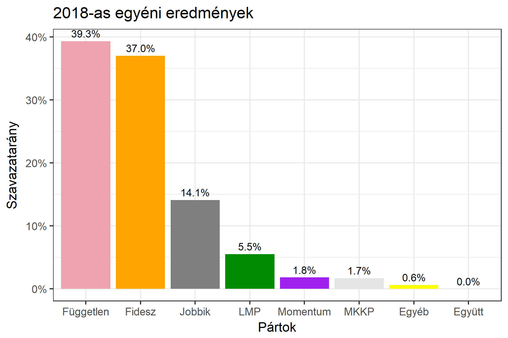

<h1 class="page-title">{{ page.title | escape }}</h1>

    

          

		  <h5>Baranya megye 1-es választókerület (Pécs)</h5>
 <h5><strong>2018-as egyéni eredmények</strong></h5>  <table class="striped">
              <thead>
                <tr>
                    <th>Jelöltek</th>
                    <th>Szavazatarány (százalék)</th>
<th>Eltérés a becsléstől</th>
                </tr>
              </thead>
              <tbody>
             <tr>
                  <td>Csizi Péter - Fidesz-KDNP </td>
				   <td id="id_fidesz">37.0%</td>
				   <td>+5.4%</td>
			</tr>
			<tr>
<td>Fogarasi Gábor - Jobbik </td>
 <td id="id_jobbik">14.1%</td>
				   <td>-0.8%</td>
				   </tr>
<tr>
                  <td>Dr. Mellár Tamás - független</td>
				   <td id="id_baloldal">39.3%</td>
				   <td>+7.9%</td>
			</tr>
			<tr>
                  <td>Dr. Keresztes László Lóránt - LMP </td>
				   <td id="id_lmp">5.5%</td>
				   <td>-7.7%</td>
			</tr>
			<tr>
				  <td>Nemes Balázs - Momentum </td>
				   <td id="id_momentum">1.8%</td>
				   <td>-5.1%</td>
			</tr>           
<tr>
<td>Nagy Richárd - MKKP </td>
		<td id="id_mkkp">1.7%</td>
				   <td>-0.3%</td>
</tr>    
              </tbody>
            </table><h6><strong>Választókerületi profil (2014-ben): Enyhén Fideszes (baloldali kihívó)</strong></h6>
 

 
			

          

    

    

          

		  <h5>Baranya megye 1-es választókerület (Pécs) - 2014-es eredmények</h5>
            <table class="striped">
              <thead>
                <tr>
                    <th>Jelöltek</th>
                    <th>Szavazatarányok</th>
                </tr>
              </thead>
              <tbody>
             <tr>
                  <td>Csizi Péter - Fidesz-KDNP</td>
				  <td>37.2%</td>
			</tr>
			<tr>
			      <td>Dr. Tóth Bertalan - Összefogás (MSZP-Együtt-DK-PM-MLP)</td>
				  <td>33.0%</td>
			      
			</tr>
			<tr>
			      <td>Németh Zsolt - Jobbik</td>
				  <td>16.5%</td>
			</tr>
			<tr>
				  <td>Dr. Kóbor József - LMP</td>
				  <td>8.9%</td>
			</tr>                
              </tbody>
            </table>
			<h5>Győztes: Fidesz-KDNP, 4.2%-kal</h5>
          

    

