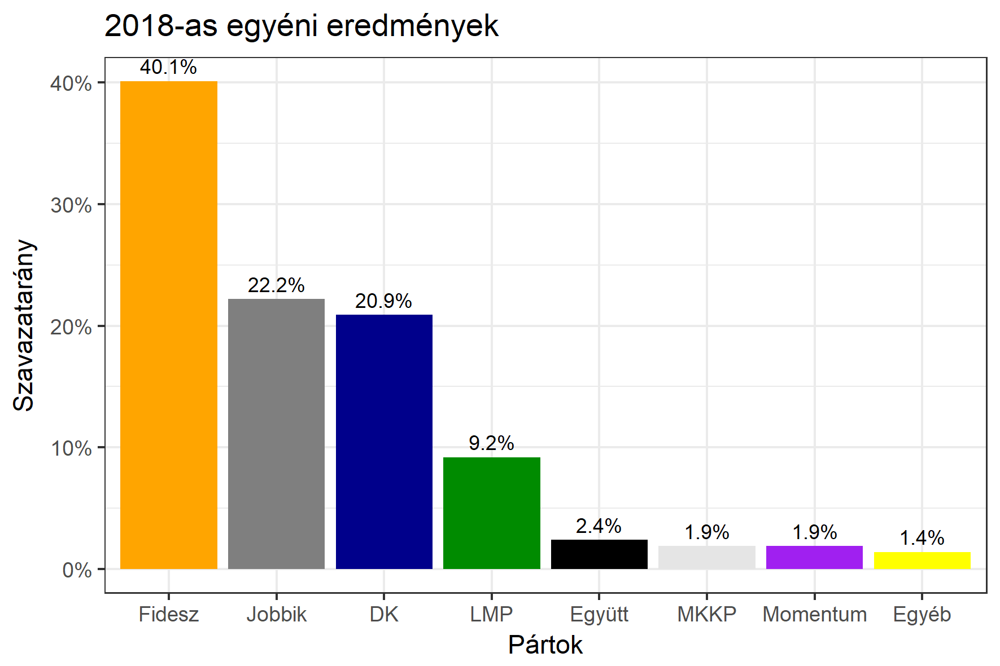

<h1 class="page-title">{{ page.title | escape }}</h1>

    

          

		  <h5>Baranya megye 2-es választókerület (Pécs)</h5>
 <h5><strong>2018-as egyéni eredmények</strong></h5>  <table class="striped">
              <thead>
                <tr>
                    <th>Jelöltek</th>
                    <th>Szavazatarány (százalék)</th>
<th>Eltérés a becsléstől</th>
                </tr>
              </thead>
              <tbody>
             <tr>
                  <td>dr. Hoppál Péter - Fidesz-KDNP </td>
				   <td id="id_fidesz">40.1%</td>
				   <td>+6.4%</td>
			</tr>
			<tr>
			<td>Gyimesi Gábor - Jobbik </td>
			<td id="id_jobbik">22.2%</td>
				   <td>+1.3%</td>
			</tr>
<tr>
                  <td>Nagy Ferenc - DK </td>
				   <td id="id_baloldal">20.9%</td>
				   <td>-8.9%</td>
			</tr>
			<tr>
                  <td>Hohn Krisztina - LMP </td>
				 <td id="id_lmp">9.2%</td>
				   <td>-0,7%</td>
			</tr>
			<tr>
				  <td>Körömi Attila - Momentum </td>
				  <td id="id_momentum">1.9%</td>
				   <td>-0.9%</td>
			</tr>
<tr>
<td>Berkecz Balázs - Együtt </td>
 <td id="id_egyutt">2.4%</td>
				   <td>+0.7%</td>
</tr>
<tr>               
<td>Marton Csongor - MKKP </td>
 <td id="id_mkkp">1.9%</td>
				   <td>+0.7%</td>
</tr>   
              </tbody>
            </table><h6><strong>Választókerületi profil (2014-ben): Enyhén Fideszes (baloldali kihívó)</strong></h6>
 

 
			

          

    

    

          

		  <h5>Baranya megye 2-es választókerület (Pécs) - 2014-es eredmények</h5>
            <table class="striped">
              <thead>
                <tr>
                    <th>Jelöltek</th>
                    <th>Szavazatarányok</th>
                </tr>
              </thead>
              <tbody>
             <tr>
                  <td>Dr. Hoppál Péter Tamás - Fidesz-KDNP</td>
				  <td>36.3%</td>
			</tr>
			<tr>
			      <td>Dr. Szakács László - Összefogás (MSZP-Együtt-DK-PM-MLP)</td>
				  <td>31.9%</td>    
			</tr>
			<tr>
			      <td>Gyimesi Gábor Jenő - Jobbik</td>
				  <td>20.7%</td>
			</tr>
			<tr>
				  <td>Dr. Keresztes László Lóránt - LMP</td>
				  <td>7.6%</td>
			</tr>                
              </tbody>
            </table>
			<h5>Győztes: Fidesz-KDNP, 4.4%-kal</h5>
          

    

