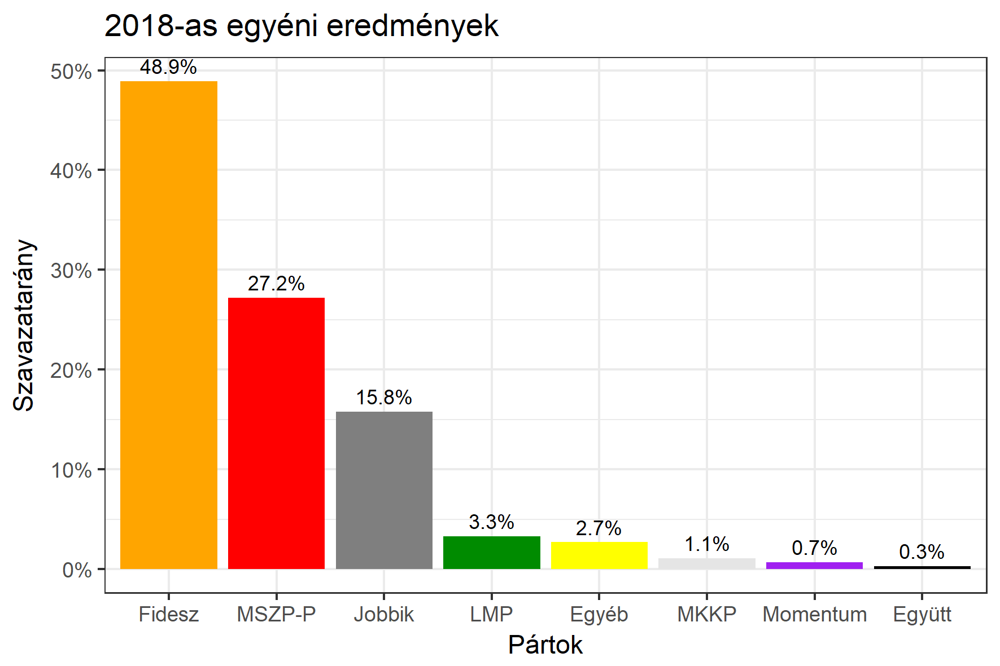

<h1 class="page-title">{{ page.title | escape }}</h1>

    

          

		  <h5>Baranya megye 4-es választókerület (Szigetvár)</h5>
 <h5><strong>2018-as egyéni eredmények</strong></h5>  <table class="striped">
              <thead>
                <tr>
                    <th>Jelöltek</th>
                    <th>Szavazatarány (százalék)</th>
<th>Eltérés a becsléstől</th>
                </tr>
              </thead>
              <tbody>
             <tr>
                  <td>Nagy Csaba - Fidesz-KDNP </td>
				   <td id="id_fidesz">48.9%</td>
				   <td>+4.9%</td>
			</tr>
			<tr><td>Andrics Alíz - Jobbik </td> 
			<td id="id_jobbik">15.8%</td>
				   <td>-7.0%</td>
			</tr>
<tr>
                  <td>dr. Vass Péter - MSZP-Párbeszéd </td>
				  <td id="id_baloldal">27.2%</td>
				   <td>-0.4%</td>
			</tr>
			<tr>
                  <td>Angyal Károly Tibor - LMP </td>
				   <td id="id_lmp">3.3%</td>
				   <td>-0.5%</td>
			</tr>
			<tr>
				  <td>Gergely Attila - Momentum </td>
				   <td id="id_momentum">0.7%</td>
				   <td>-0.6%</td>
			</tr>
    <tr>
<td>Rajnai Attila - Együtt </td>
 <td id="id_egyutt">0.3%</td>
				   <td>+0.3%</td>
</tr>          
<tr>
<td>Iván Petra - MKKP </td>
 <td id="id_mkkp">1.1%</td>
				   <td>+0.6%</td>
</tr>          
              </tbody>
            </table><h6><strong>Választókerületi profil (2014-ben): Stabil Fideszes</strong></h6>
 

 
			

          

    

    

          

		  <h5>Baranya megye 4-es választókerület (Szigetvár) - 2014-es eredmények</h5>
            <table class="striped">
              <thead>
                <tr>
                    <th>Jelöltek</th>
                    <th>Szavazatarányok</th>
                </tr>
              </thead>
              <tbody>
             <tr>
                  <td>Tiffán Zsolt - Fidesz-KDNP</td>
				  <td>44.1%</td>
			</tr>
			<tr>
			      <td>Nagy Attila - Összefogás (MSZP-Együtt-DK-PM-MLP)</td>
				  <td>27.3%</td>
			      
			</tr>
			<tr>
			      <td>Vida Dezső Zoltán - Jobbik</td>
				  <td>20.5%</td>
			</tr>
			<tr>
				  <td>Angyal Károly Tibor - LMP</td>
				  <td>3.2%</td>
			</tr>                
              </tbody>
            </table>
			<h5>Győztes: Fidesz-KDNP, 16.8%-kal</h5>
          

    

