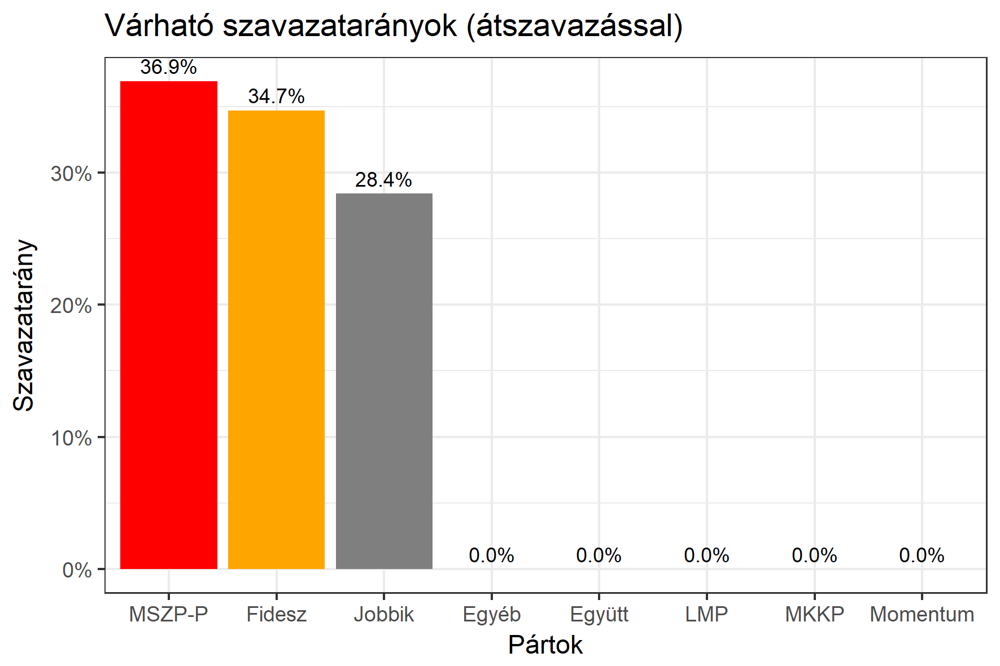

<h1 class="page-title">{{ page.title | escape }}</h1>

    

          
<h6><strong>A következő becslés várható időpontja: 2018. március 19.</strong></h6>
		  <h5>Borsod-Abaúj-Zemplén megye 2-es választókerület (Miskolc)</h5>
 <h6><strong>Választókerületi profil (2014-ben): Háromesélyes</strong></h6>
 
<h6><strong>Legfrissebb 2018-as becslések eredménye:</strong></h6> 
			<h5><strong>Legesélyesebb ellenzéki jelölt: Jobbik</strong></h5>
<table class="striped">
              <thead>
                <tr>
                    <th>Jelöltek</th>
                    <th>Várható szavazatarány egyéniben (átszavazással)</th>
                </tr>
              </thead>
              <tbody>
             <tr>
                  <td>Hubay György - Fidesz-KDNP </td>
				  <td id="id_fidesz">31.6%</td>
			</tr>
			<tr><td>Pakusza Zoltán - Jobbik </td><td id="id_jobbik">45.0%</td></tr>
<tr>
                  <td>dr. Varga László - MSZP-Párbeszéd </td>
				  <td id="id_baloldal">17.1%</td>
			</tr>
			<tr>
                  <td>Doszpoly Botond László - LMP </td>
				  <td id="lmp">3.2%</td>
			</tr>
			<tr>
				  <td>Dudás Norbert - Momentum </td>
				  <td id="id_momentum">3.0%</td>
			</tr>
                
              </tbody>
            </table><h5>Várható győztes: Jobbik</h5>
			
			
  
<strong>Fontos:</strong> A becslések csak az egyéni jelöltre adott szavazatok arányát mutatják, nem a listás szavazatokét. A becslés jelentős eltérést mutathat a kisebb pártok esetében és olyan kerületekben, ahol nincs egyértelmű esélyes jelölt.

 
			
 <h6><strong>Becslés megbízhatósága a legesélyesebb jelöltről:</strong> <strong>Egyértelmű az esélyes - az esélyes jelölt várhatóan nem változik</strong></h6>

Megjegyzés a kerülethez: Ebben a körzetben a Jobbik jóval erősebb az országos átlagánál, de szüksége van a baloldali szavazók átszavazására ahhoz, hogy megnyerje a kerületet.

Az aktuális becslés leírásáról <a href="../metodologia#0312">bővebben itt olvashatsz</a>.

    

    

          

		  <h5>Borsod-Abaúj-Zemplén megye 2-es választókerület (Miskolc) - 2014-es eredmények</h5>
            <table class="striped">
              <thead>
                <tr>
                    <th>Jelöltek</th>
                    <th>Szavazatarányok</th>
                </tr>
              </thead>
              <tbody>
			  <tr>
				  <td>Dr. Varga László - Összefogás (MSZP-Együtt-DK-PM-MLP)</td>
				  <td>31.4%</td>
			</tr>
             <tr>
                  <td>Sebestyén László - Fidesz-KDNP</td>
				  <td>30.9%</td>
			</tr>
			<tr>
			      <td>Pakusza Zoltán - Jobbik</td>
				  <td>30.6%</td>
			</tr>
			<tr>
				  <td>Mile Lajos - LMP</td>
				  <td>3.3%</td>
			</tr>                
              </tbody>
            </table>
			<h5>Győztes: Összefogás, 0.5%-kal</h5>
          

    

