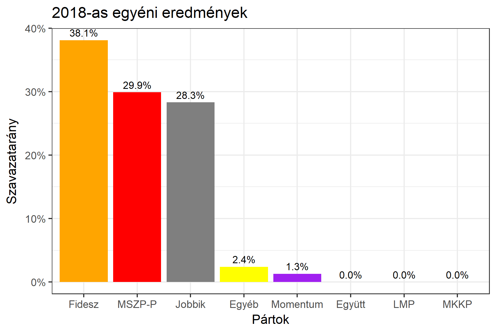

<h1 class="page-title">{{ page.title | escape }}</h1>

    

          

		  <h5>Borsod-Abaúj-Zemplén megye 2-es választókerület (Miskolc)</h5>
 <h5><strong>2018-as egyéni eredmények</strong></h5>  <table class="striped">
              <thead>
                <tr>
                    <th>Jelöltek</th>
                    <th>Szavazatarány (százalék)</th>
<th>Eltérés a becsléstől</th>
                </tr>
              </thead>
              <tbody>
             <tr>
                  <td>Hubay György - Fidesz-KDNP </td>
				  <td id="id_fidesz">38.1%</td>
				   <td>+3.4%</td>
			</tr>
			<tr><td>Pakusza Zoltán - Jobbik </td> 
			<td id="id_jobbik">28.3%</td>
				   <td>-0.1%</td>
			</tr>
<tr>
                  <td>dr. Varga László - MSZP-Párbeszéd </td>
				  <td id="id_baloldal">29.9%</td>
				   <td>-7.0%</td>
			</tr>    
			<tr>
				  <td>Dudás Norbert - Momentum </td>
				  <td id="id_momentum">1.3%</td>
				   <td>+1.3%</td>
			</tr>
              </tbody>
            </table><h6><strong>Választókerületi profil (2014-ben): Háromesélyes</strong></h6>
 

 
			

    

    

          

		  <h5>Borsod-Abaúj-Zemplén megye 2-es választókerület (Miskolc) - 2014-es eredmények</h5>
            <table class="striped">
              <thead>
                <tr>
                    <th>Jelöltek</th>
                    <th>Szavazatarányok</th>
                </tr>
              </thead>
              <tbody>
			  <tr>
				  <td>Dr. Varga László - Összefogás (MSZP-Együtt-DK-PM-MLP)</td>
				  <td>31.4%</td>
			</tr>
             <tr>
                  <td>Sebestyén László - Fidesz-KDNP</td>
				  <td>30.9%</td>
			</tr>
			<tr>
			      <td>Pakusza Zoltán - Jobbik</td>
				  <td>30.6%</td>
			</tr>
			<tr>
				  <td>Mile Lajos - LMP</td>
				  <td>3.3%</td>
			</tr>                
              </tbody>
            </table>
			<h5>Győztes: Összefogás, 0.5%-kal</h5>
          

    

