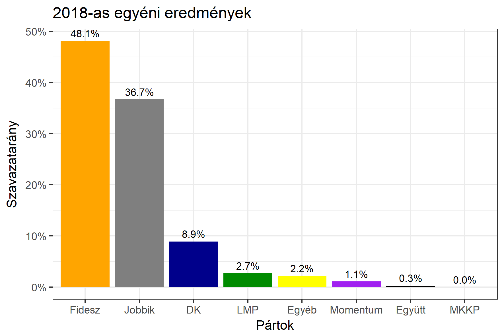
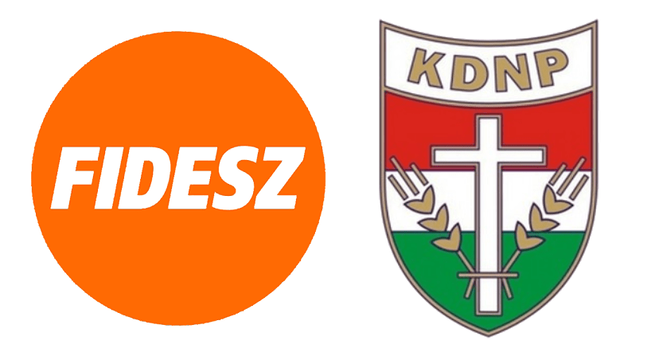

<h1 class="page-title">{{ page.title | escape }}</h1>

    

          

		  <h5>Borsod-Abaúj-Zemplén megye 3-as választókerület (Ózd)</h5>
 <h5><strong>2018-as egyéni eredmények</strong></h5>  <table class="striped">
              <thead>
                <tr>
                    <th>Jelöltek</th>
                    <th>Szavazatarány (százalék)</th>
<th>Eltérés a becsléstől</th>
                </tr>
              </thead>
              <tbody>
             <tr>
                  <td>Riz Gábor - Fidesz-KDNP </td>
				   <td id="id_fidesz">48.1%</td>
				   <td>+9.3%</td>
			</tr>
			<tr><td>Farkas Péter Barnabás - Jobbik </td> 
			<td id="id_jobbik">36.7%</td>
				   <td>-5.2%</td>
			</tr>
<tr>
                  <td>Varga Gergő - DK </td>
				   <td id="id_baloldal">8.0%</td>
				   <td>-8.9%</td>
			</tr>
			<tr>
                  <td>Koleszár István - LMP </td>
				   <td id="id_lmp">2.7%</td>
				   <td>+0.9%</td>
			</tr>
			<tr>
				  <td>Kovács József - Momentum </td>
				   <td id="id_momentum">1.1%</td>
				   <td>+0.5%</td>
			</tr>
			<tr>
<td>Báder József - Együtt </td>
 <td id="id_egyutt">0.3%</td>
				   <td>+0.3%</td>
</tr> 
                
              </tbody>
            </table><h6><strong>Választókerületi profil (2014-ben): Enyhén Fideszes (Jobbik / baloldal az esélyes kihívók)</strong></h6>
 

 
			

          

    

    

          

		  <h5>Borsod-Abaúj-Zemplén megye 3-as választókerület (Ózd) - 2014-es eredmények</h5>
            <table class="striped">
              <thead>
                <tr>
                    <th>Jelöltek</th>
                    <th>Szavazatarányok</th>
                </tr>
              </thead>
              <tbody>
			  <tr>
                  <td>Riz Gábor - Fidesz-KDNP</td>
				  <td>37.8%</td>
			  </tr>
			  <tr>
			      <td>Egyed Zsolt - Jobbik</td>
				  <td>29.6%</td>
			</tr>
			  <tr>
				  <td>Nyakó István - Összefogás (MSZP-Együtt-DK-PM-MLP)</td>
				  <td>24.8%</td>
			</tr>
			<tr>
				  <td>Emődi Zoltán - LMP</td>
				  <td>1.5%</td>
			</tr>                
              </tbody>
            </table>
			<h5>Győztes: Fidesz-KDNP, 8.2%-kal</h5>
          

    

