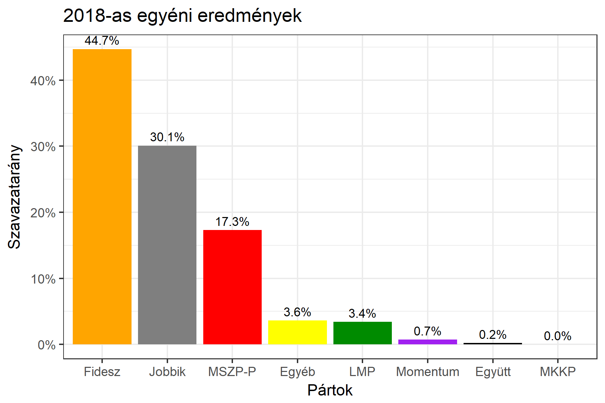

<h1 class="page-title">{{ page.title | escape }}</h1>

    

          

		  <h5>Borsod-Abaúj-Zemplén megye 4-es választókerület (Kazincbarcika)</h5>
		   
		  <iframe src="https://tisztaszavazas-webclient-git-ssr-terkep-gazdagergo.vercel.app/egyedi-lekerdezesek/oekv-kulonbseg/5eee82a88ecde100236309e0?embedded=true&hide_table=true" width="100%" height="600" style="border: 0;"></iframe>
		   
 <h5><strong>2018-as egyéni eredmények</strong></h5>  <table class="striped">
              <thead>
                <tr>
                    <th>Jelöltek</th>
                    <th>Szavazatarány (százalék)</th>
<th>Eltérés a becsléstől</th>
                </tr>
              </thead>
              <tbody>
             <tr>
                  <td>Demeter Zoltán - Fidesz-KDNP </td>
				   <td id="id_fidesz">44.7%</td>
				   <td>+6.9%</td>
			</tr>
			<tr><td>Egyed Zsolt - Jobbik </td> 
			<td id="id_jobbik">30.1%</td>
				   <td>-9.3%</td>
			</tr>
<tr>
                  <td>Gúr Nándor - MSZP-Párbeszéd </td>
				   <td id="id_baloldal">17.3%</td>
				   <td>-2.1%</td>
			</tr>
			<tr>
                  <td>Üveges Gábor - LMP </td>
				   <td id="id_lmp">3.4%</td>
				   <td>+1.2%</td>
			</tr>
			<tr>
				  <td>Győri Gyula - Momentum </td>
				  <td id="id_momentum">0.7%</td>
				   <td>-0.1%</td>
			</tr>
<tr>
<td>Elek Zsófia -  Együtt </td>
 <td id="id_egyutt">0.2%</td>
				   <td>-0.3%</td>
</tr>                
              </tbody>
            </table><h6><strong>Választókerületi profil (2014-ben): Enyhén Fideszes (Jobbik / baloldal az esélyes kihívók)</strong></h6>
 

 
			

          

    

    

          

		  <h5>Borsod-Abaúj-Zemplén megye 4-es választókerület (Kazincbarcika) - 2014-es eredmények</h5>
            <table class="striped">
              <thead>
                <tr>
                    <th>Jelöltek</th>
                    <th>Szavazatarányok</th>
                </tr>
              </thead>
              <tbody>
			  <tr>
                  <td>Demeter Zoltán - Fidesz-KDNP</td>
				  <td>37.1%</td>
			  </tr>
			  <tr>
				  <td>Klimon István - Összefogás (MSZP-Együtt-DK-PM-MLP)</td>
				  <td>28.0%</td>
			</tr>
			<tr>
			      <td>Miklós Árpád - Jobbik</td>
				  <td>27.8%</td>
			</tr>
			<tr>
				  <td>Emődi Zoltán - LMP</td>
				  <td>1.9%</td>
			</tr>                
              </tbody>
            </table>
			<h5>Győztes: Fidesz-KDNP, 9.1%-kal</h5>
          

    

