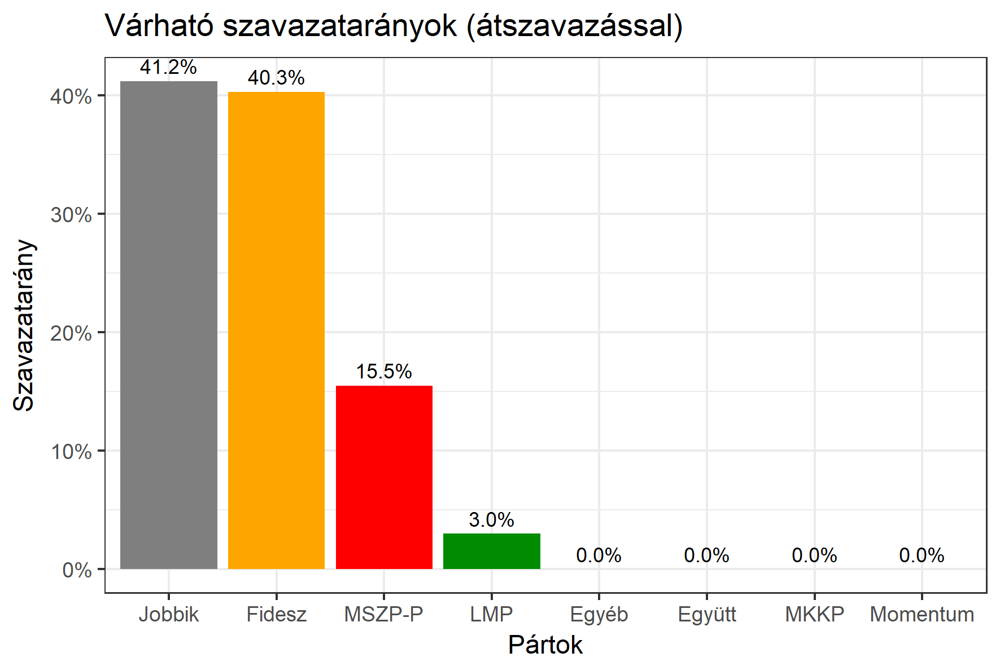

<h1 class="page-title">{{ page.title | escape }}</h1>

    

          
<h6><strong>A következő becslés várható időpontja: 2018. március 19.</strong></h6>
		  <h5>Borsod-Abaúj-Zemplén megye 6-os választókerület (Tiszaújváros)</h5>
 <h6><strong>Választókerületi profil (2014-ben): Enyhén Fideszes (Jobbik)</strong></h6>
 
<h6><strong>Legfrissebb 2018-as becslések eredménye:</strong></h6> 
			<h5><strong>Legesélyesebb ellenzéki jelölt: Jobbik</strong></h5>
<table class="striped">
              <thead>
                <tr>
                    <th>Jelöltek</th>
                    <th>Várható szavazatarány egyéniben (átszavazással)</th>
                </tr>
              </thead>
              <tbody>
             <tr>
                  <td>Koncz Ferenc - Fidesz-KDNP </td>
				  <td id="id_fidesz">42.4%</td>
			</tr>
			<tr><td>Bíró László - Jobbik </td><td id="id_jobbik">41.3%</td></tr>
<tr>
                  <td>Pap Zsolt - MSZP-Párbeszéd </td>
				  <td id="id_baloldal">13.3%</td>
			</tr>
			<tr>
                  <td>dr. Tarnai Gábor - LMP </td>
				  <td id="lmp">3.1%</td>
			</tr>
			<tr>
				  </tr>
                
              </tbody>
            </table><h5>Várható győztes: Fidesz</h5>
			
			
  
<strong>Fontos:</strong> A becslések csak az egyéni jelöltre adott szavazatok arányát mutatják, nem a listás szavazatokét. A becslés jelentős eltérést mutathat a kisebb pártok esetében és olyan kerületekben, ahol nincs egyértelmű esélyes jelölt.

 
			
 <h6><strong>Becslés megbízhatósága a legesélyesebb jelöltről:</strong> <strong>Egyértelmű az esélyes - az esélyes jelölt várhatóan nem változik</strong></h6>

Megjegyzés a kerülethez: A Jobbik esélyes, de több átszavazóra van szüksége a mandátumhoz.

Az aktuális becslés leírásáról <a href="../metodologia#0312">bővebben itt olvashatsz</a>.

          

    

    

          

		  <h5>Borsod-Abaúj-Zemplén megye 6-os választókerület (Tiszaújváros) - 2014-es eredmények</h5>
            <table class="striped">
              <thead>
                <tr>
                    <th>Jelöltek</th>
                    <th>Szavazatarányok</th>
                </tr>
              </thead>
              <tbody>
			  <tr>
                  <td>Dr. Mengyi Roland - Fidesz-KDNP</td>
				  <td>40.4%</td>
			  </tr>
			  <tr>
			      <td>Balla Gergő - Jobbik</td>
				  <td>29.6%</td>
			  </tr>
			  <tr>
				  <td>Pap Zsolt - Összefogás (MSZP-Együtt-DK-PM-MLP)</td>
				  <td>23.5%</td>
			</tr>
			<tr>
				  <td>Dr. Tarnai Gábor Elemér - LMP</td>
				  <td>2.6%</td>
			</tr>                
              </tbody>
            </table>
			<h5>Győztes: Fidesz-KDNP, 10.8%-kal</h5>
          

    

