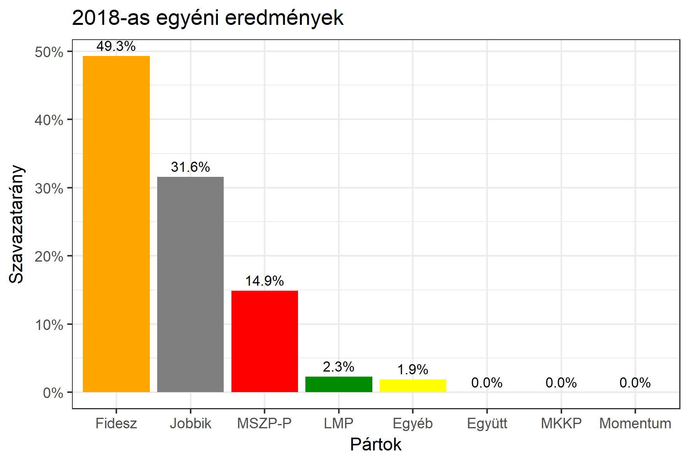

<h1 class="page-title">{{ page.title | escape }}</h1>

    

          

		  <h5>Borsod-Abaúj-Zemplén megye 6-os választókerület (Tiszaújváros)</h5>
 <h5><strong>2018-as egyéni eredmények</strong></h5>  <table class="striped">
              <thead>
                <tr>
                    <th>Jelöltek</th>
                    <th>Szavazatarány (százalék)</th>
<th>Eltérés a becsléstől</th>
                </tr>
              </thead>
              <tbody>
             <tr>
                  <td>Koncz Ferenc - Fidesz-KDNP </td>
				   <td id="id_fidesz">49.3%</td>
				   <td>+9.0%</td>
			</tr>
			<tr><td>Bíró László - Jobbik </td> 
			<td id="id_jobbik">31.6%</td>
				   <td>-9.6%</td>
			</tr>
<tr>
                  <td>Pap Zsolt - MSZP-Párbeszéd </td>
				  <td id="id_baloldal">14.9%</td>
				   <td>-0.6%</td>
			</tr>
			<tr>
                  <td>dr. Tarnai Gábor - LMP </td>
				   <td id="id_lmp">2.3%</td>
				   <td>-0.7%</td>
			</tr>
			<tr>
				  </tr>
                
              </tbody>
            </table><h6><strong>Választókerületi profil (2014-ben): Enyhén Fideszes (Jobbik kihívó)</strong></h6>
 

 
			

          

    

    

          

		  <h5>Borsod-Abaúj-Zemplén megye 6-os választókerület (Tiszaújváros) - 2014-es eredmények</h5>
            <table class="striped">
              <thead>
                <tr>
                    <th>Jelöltek</th>
                    <th>Szavazatarányok</th>
                </tr>
              </thead>
              <tbody>
			  <tr>
                  <td>Dr. Mengyi Roland - Fidesz-KDNP</td>
				  <td>40.4%</td>
			  </tr>
			  <tr>
			      <td>Balla Gergő - Jobbik</td>
				  <td>29.6%</td>
			  </tr>
			  <tr>
				  <td>Pap Zsolt - Összefogás (MSZP-Együtt-DK-PM-MLP)</td>
				  <td>23.5%</td>
			</tr>
			<tr>
				  <td>Dr. Tarnai Gábor Elemér - LMP</td>
				  <td>2.6%</td>
			</tr>                
              </tbody>
            </table>
			<h5>Győztes: Fidesz-KDNP, 10.8%-kal</h5>
          

    

