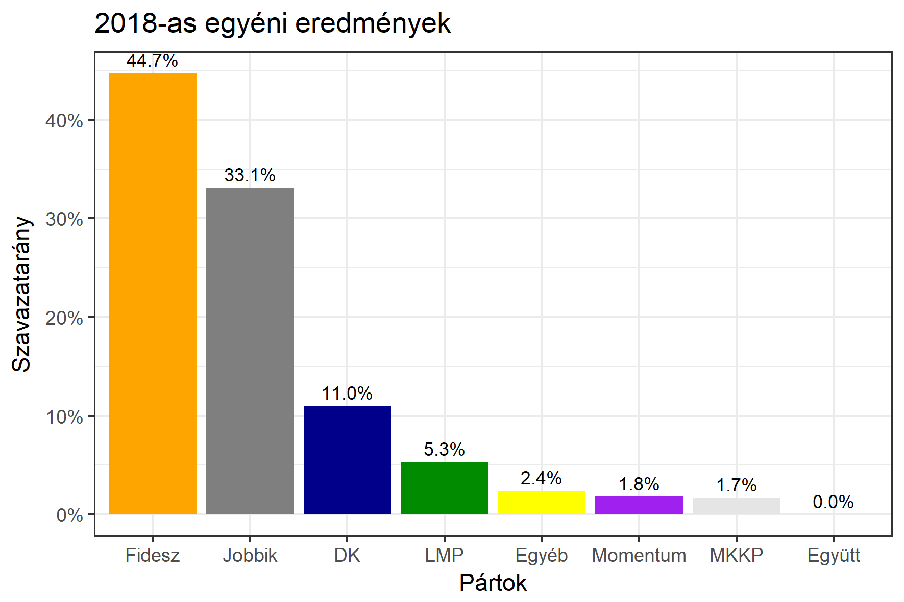

<h1 class="page-title">{{ page.title | escape }}</h1>

    

          

		  <h5>Békés megye 1-es választókerület (Békéscsaba)</h5>
 <h5><strong>2018-as egyéni eredmények</strong></h5>  <table class="striped">
              <thead>
                <tr>
                    <th>Jelöltek</th>
                    <th>Szavazatarány (százalék)</th>
<th>Eltérés a becsléstől</th>
                </tr>
              </thead>
              <tbody>
             <tr>
                  <td>Herczeg Tamás - Fidesz-KDNP </td>
				   <td id="id_fidesz">44.7%</td>
				   <td>+5.0%</td>
			</tr>
			<tr><td>Kocziha Tünde - Jobbik </td> 
			<td id="id_jobbik">33.1%</td>
				   <td>+4.4%</td>
			</tr>
<tr>
                  <td>Nagy-Huszein Tibor - DK </td>
				   <td id="id_baloldal">11.0%</td>
				   <td>-9.1%</td>
			</tr>
			<tr>
                  <td>Kovács Katalin Ildikó - LMP </td>
				  <td id="id_lmp">5.3%</td>
				   <td>-1.4%</td>
			</tr>
			<tr>
				  <td>Almási István - Momentum </td>
				   <td id="id_momentum">1.8%</td>
				   <td>-1.2%</td>
			</tr>
   
<tr>
<td>Babiniszki Péter - MKKP </td>
 <td id="id_mkkp">1.7%</td>
				   <td>-0.1%</td>
</tr>                
              </tbody>
            </table><h6><strong>Választókerületi profil (2014-ben): Stabil Fideszes</strong></h6>
 

 
			

          

    

    

          

		  <h5>Békés megye 1-es választókerület (Békéscsaba) - 2014-es eredmények</h5>
            <table class="striped">
              <thead>
                <tr>
                    <th>Jelöltek</th>
                    <th>Szavazatarányok</th>
                </tr>
              </thead>
              <tbody>
             <tr>
                  <td>Vantara Gyula - Fidesz-KDNP</td>
				  <td>41.1%</td>
			</tr>
			<tr>
			      <td>Miklós Attila Zsolt - Összefogás (MSZP-Együtt-DK-PM-MLP)</td>
				  <td>27.2%</td>
			      
			</tr>
			<tr>
			      <td>Dr. Dévényi-Dabrowsky Géza Dániel - Jobbik</td>
				  <td>20.8%</td>
			</tr>
			<tr>
				  <td>Takács Péter - LMP</td>
				  <td>6.0%</td>
			</tr>                
              </tbody>
            </table>
			<h5>Győztes: Fidesz-KDNP, 13.9%-kal</h5>
          

    

