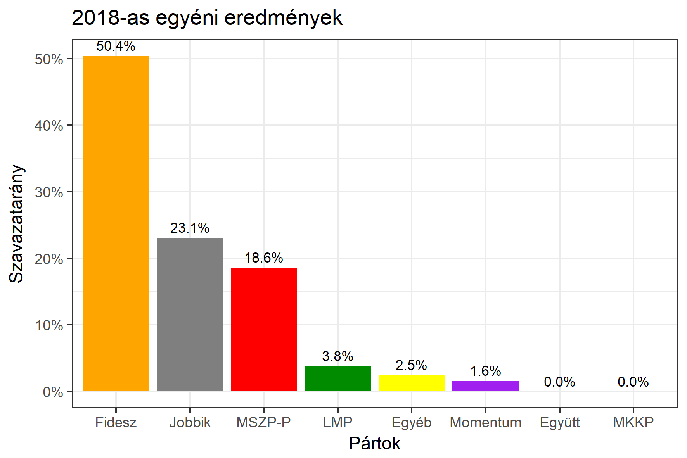

<h1 class="page-title">{{ page.title | escape }}</h1>

    

          

		  <h5>Békés megye 3-as választókerület (Gyula)</h5>
 <h5><strong>2018-as egyéni eredmények</strong></h5>  
<table class="striped">
              <thead>
                <tr>
                    <th>Jelöltek</th>
                    <th>Szavazatarány (százalék)</th>
					<th>Eltérés a becsléstől</th>
                </tr>
              </thead>
              <tbody>
             <tr>
                  <td>dr. Kovács József - Fidesz-KDNP </td>
				   <td id="id_fidesz">50.4%</td>
				   <td>-0.4%</td>
			</tr>
			<tr>
			<td>Dr. Dévényi-Dabrowsky Géza - Jobbik </td> 
			<td id="id_jobbik">23.1%</td>
				   <td>-2.8%</td>
			</tr>
			<tr>
                  <td>Pluhár László - MSZP-Párbeszéd </td>
				   <td id="id_baloldal">18.6%</td>
				   <td>-0.1%</td>
			</tr>
			<tr>
                  <td>Szabó László - LMP </td>
				  <td id="id_lmp">3.8%</td>
				   <td>+0.4%</td>
			</tr>
			<tr>
				  <td>Nagy Zoltán - Momentum </td>
				   <td id="id_momentum">1.6%</td>
				   <td>+0.4%</td>
			</tr>
              </tbody>
            </table>
			<h6><strong>Választókerületi profil (2014-ben): Stabil Fideszes</strong></h6>
 

 
			

          

    

    

          

		  <h5>Békés megye 3-as választókerület (Gyula) - 2014-es eredmények</h5>
            <table class="striped">
              <thead>
                <tr>
                    <th>Jelöltek</th>
                    <th>Szavazatarányok</th>
                </tr>
              </thead>
              <tbody>
             <tr>
                  <td>Dr. Kovács József Dezső - Fidesz-KDNP</td>
				  <td>46.8%</td>
			</tr>
			<tr>
			     <td>Bod Tamás - Összefogás (MSZP-Együtt-DK-PM-MLP)</td>
				 <td>22.7%</td>
			</tr>
			<tr>
				  <td>Varga Géza István - Jobbik</td>
				  <td>18.4%</td>
			</tr>
			<tr>
				  <td>Kásler Árpád - A Haza Nem Eladó</td>
				  <td>5.7%</td>
			</tr> 
            <tr>
				  <td>Földi Mihály István - LMP</td>
				  <td>2.7%</td>
			</tr>			
              </tbody>
            </table>
			<h5>Győztes: Fidesz-KDNP, 24.1%-kal</h5>
          

    

