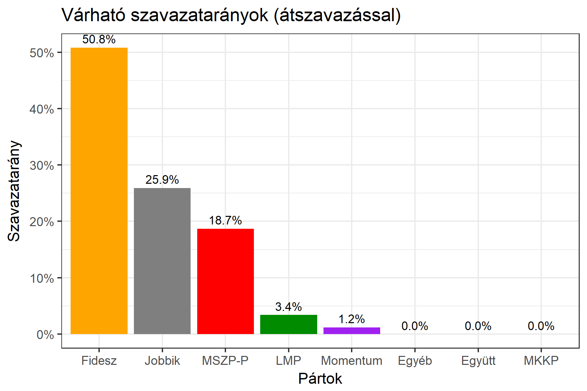

<h1 class="page-title">{{ page.title | escape }}</h1>

    

          
<h6><strong>A következő becslés várható időpontja: 2018. március 19.</strong></h6>
		  <h5>Békés megye 3-as választókerület (Gyula)</h5>
 <h6><strong>Választókerületi profil (2014-ben): Stabil Fideszes</strong></h6>
 
<h6><strong>Legfrissebb 2018-as becslések eredménye:</strong></h6> 
			<h5><strong>Legesélyesebb ellenzéki jelölt: Jobbik</strong></h5>
<table class="striped">
              <thead>
                <tr>
                    <th>Jelöltek</th>
                    <th>Várható szavazatarány egyéniben (átszavazással)</th>
                </tr>
              </thead>
              <tbody>
             <tr>
                  <td>dr. Kovács József - Fidesz-KDNP </td>
				  <td id="id_fidesz">49.9%</td>
			</tr>
			<tr><td>Dr. Dévényi-Dabrowsky Géza - Jobbik </td><td id="id_jobbik">22.9%</td></tr>
<tr>
                  <td>Pluhár László - MSZP-Párbeszéd </td>
				  <td id="id_baloldal">20.8%</td>
			</tr>
			<tr>
                  <td>Szabó László - LMP 
				  </td>
				  <td id="lmp">3.3%</td>
			</tr>
			<tr>
				  <td>Nagy Zoltán - Momentum </td>
				  <td id="id_momentum">3.0%</td>
			</tr>
                
              </tbody>
            </table><h5>Várható győztes: Fidesz</h5>
			
			
  
<strong>Fontos:</strong> A becslések csak az egyéni jelöltre adott szavazatok arányát mutatják, nem a listás szavazatokét. A becslés jelentős eltérést mutathat a kisebb pártok esetében és olyan kerületekben, ahol nincs egyértelmű esélyes jelölt.

 
			
 <h6><strong>Becslés megbízhatósága a legesélyesebb jelöltről:</strong> <strong>Nem egyértelmű az esélyes - az esélyes jelölt még változhat</strong></h6>

Megjegyzés a kerülethez: A Fidesz biztosan vezet, az ellenzéknek magas részvétel és mozgósítás esetén van esélye a kerületben.

Az aktuális becslés leírásáról <a href="../metodologia#0312">bővebben itt olvashatsz</a>.

          

    

    

          

		  <h5>Békés megye 3-as választókerület (Gyula) - 2014-es eredmények</h5>
            <table class="striped">
              <thead>
                <tr>
                    <th>Jelöltek</th>
                    <th>Szavazatarányok</th>
                </tr>
              </thead>
              <tbody>
             <tr>
                  <td>Dankó Béla - Fidesz-KDNP</td>
				  <td>46.8%</td>
			</tr>
			<tr>
			     <td>Rejtő József - Összefogás (MSZP-Együtt-DK-PM-MLP)</td>
				 <td>22.7%</td>
			</tr>
			<tr>
				  <td>Samu Tamás Gergő - Jobbik</td>
				  <td>18.4%</td>
			</tr>
			<tr>
				  <td>Kásler Árpád - A Haza Nem Eladó</td>
				  <td>5.7%</td>
			</tr> 
            <tr>
				  <td>Földi Mihály István - LMP</td>
				  <td>2.7%</td>
			</tr>			
              </tbody>
            </table>
			<h5>Győztes: Fidesz-KDNP, 24.1%-kal</h5>
          

    

