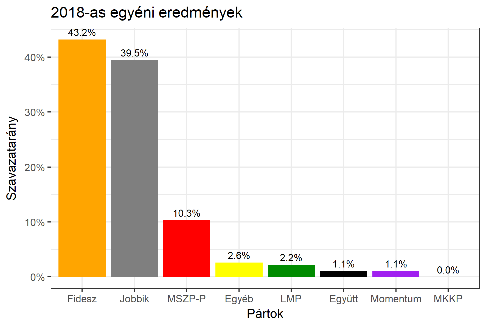

<h1 class="page-title">{{ page.title | escape }}</h1>

    

          

		  <h5>Békés megye 4-es választókerület (Orosháza)</h5>
 <h5><strong>2018-as egyéni eredmények</strong></h5>  <table class="striped">
              <thead>
                <tr>
                    <th>Jelöltek</th>
                    <th>Szavazatarány (százalék)</th>
<th>Eltérés a becsléstől</th>
                </tr>
              </thead>
              <tbody>
             <tr>
                  <td>Simonka György - Fidesz-KDNP </td>
				   <td id="id_fidesz">43.2%</td>
				   <td>-1.1%</td>
			</tr>
			<tr><td>Dr. Szabó Ervin - Jobbik </td> 
			<td id="id_jobbik">39.5%</td>
				   <td>+6.1%</td>
			</tr>
<tr>
                  <td>Füvesi Sándor - MSZP-Párbeszéd </td>
				   <td id="id_baloldal">10.3%</td>
				   <td>-6.2%</td>
			</tr>
			<tr>
                  <td>Németh Sándor - LMP </td>
				   <td id="id_lmp">2.2%</td>
				   <td>-1.5%</td>
			</tr>
			<tr>
				  <td>Sebők Éva - Momentum </td>
				  <td id="id_momentum">1.1%</td>
				   <td>-0.2%</td>
			</tr>
<tr>
<td>Bod Tamás -  Együtt </td>
 <td id="id_egyutt">1.1%</td>
				   <td>+0.3%</td>
</tr>                
              </tbody>
            </table><h6><strong>Választókerületi profil (2014-ben): Stabil Fideszes</strong></h6>
 

 
			

          

    

    

          

		  <h5>Békés megye 4-es választókerület (Orosháza) - 2014-es eredmények</h5>
            <table class="striped">
              <thead>
                <tr>
                    <th>Jelöltek</th>
                    <th>Szavazatarányok</th>
                </tr>
              </thead>
              <tbody>
             <tr>
                  <td>Simonka György - Fidesz-KDNP</td>
				  <td>45.4%</td>
			</tr>
			<tr>
			      <td>Varga Zoltán - Összefogás (MSZP-Együtt-DK-PM-MLP)</td>
				  <td>23.4%</td>
			</tr>
			<tr>
			      <td>Jámbor Nándor - Jobbik</td>
				  <td>22.7%</td>
			</tr>
			<tr>
				  <td>Nagy Gábor - LMP</td>
				  <td>3.3%</td>
			</tr>                
              </tbody>
            </table>
			<h5>Győztes: Fidesz-KDNP, 22.0%-kal</h5>
          

    

