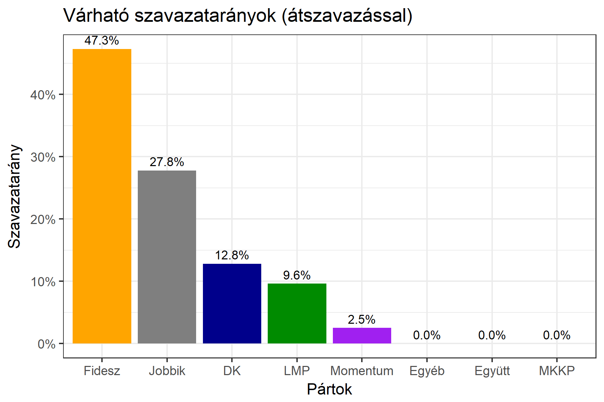

<h1 class="page-title">{{ page.title | escape }}</h1>

    

          
<h6><strong>A következő becslés várható időpontja: 2018. április 2.</strong></h6>
		  <h5>Bács-Kiskun megye 1-es választókerület (Kecskemét)</h5>
 <h6><strong>Választókerületi profil (2014-ben): Biztos Fideszes</strong></h6>
 
<h6><strong>Legfrissebb 2018-as becslések eredménye (átszavazással):</strong></h6>  
			<h6><strong>Becslés megbízhatósága a legesélyesebb jelöltről:</strong> <strong>Nincs egyértelmű esélyes</strong></h6> 
<h5><strong>Legesélyesebb ellenzéki jelölt: Lejer Zoltán (Jobbik)</strong></h5>
<h5><strong><a href="https://rendszervaltas2018.hu">Márki-Zay Péter ajánlása</a>: </strong></h5>
<table class="striped">
              <thead>
                <tr>
                    <th>Jelöltek</th>
                    <th>Várható szavazatarány egyéniben (zárójelben az arányok átszavazás esetén)</th>
                </tr>
              </thead>
              <tbody>
             <tr>
                  <td>dr. Salacz László - Fidesz-KDNP </td>
				   <td id="id_fidesz">48.7% &emsp; (49.9%)</td>
			</tr>
			<tr>
<td>Lejer Zoltán - Jobbik </td>
 <td id="id_jobbik">19.8% &emsp; (24.0%)</td></tr>
			<tr>
                  <td>Szőkéné Kopping Rita - DK </td>
				   <td id="id_baloldal">14.2% &emsp; (13.7%)</td>
			</tr>
			<tr>
                  <td>Vágó Gábor - LMP </td>
				   <td id="id_lmp">11.4% &emsp; (9.8%)</td>
			</tr>
			<tr>
				  <td>Szarvas Koppány Bendegúz - Momentum </td>
				   <td id="id_momentum">3.0% &emsp; (2.6%)</td>
			</tr>
                
              </tbody>
            </table><h5>Várható győztes: Fidesz</h5>
			
			
 
<strong>Fontos:</strong> A becslések csak az egyéni jelöltre adott szavazatok arányát mutatják, nem a listás szavazatokét. A becslés jelentős eltérést mutathat a kisebb pártok esetében és olyan kerületekben, ahol nincs egyértelmű esélyes jelölt.

 
			

Az aktuális becslés leírásáról <a href="../metodologia#0326">bővebben itt olvashatsz</a>.

          

    

    

          

		  <h5>Bács-Kiskun megye 1-es választókerület (Kecskemét) - 2014-es eredmények</h5>
            <table class="striped">
              <thead>
                <tr>
                    <th>Jelöltek</th>
                    <th>Szavazatarányok</th>
                </tr>
              </thead>
              <tbody>
             <tr>
                  <td>Dr. Salacz László - Fidesz-KDNP</td>
				  <td>51.3%</td>
			</tr>
			<tr>
			      <td>Gyöngyösi Márton Balázs - Jobbik</td>
				  <td>20.5%</td>

			</tr>
			<tr>
                  <td>Király József - Összefogás (MSZP-Együtt-DK-PM-MLP)</td>
				  <td>19.7%</td>
			</tr>
			<tr>
				  <td>Kriskó Dávid Gábor - LMP</td>
				  <td>5.3%</td>
			</tr>                
              </tbody>
            </table>
			<h5>Győztes: Fidesz-KDNP, 30.8%-kal</h5>
          

    

