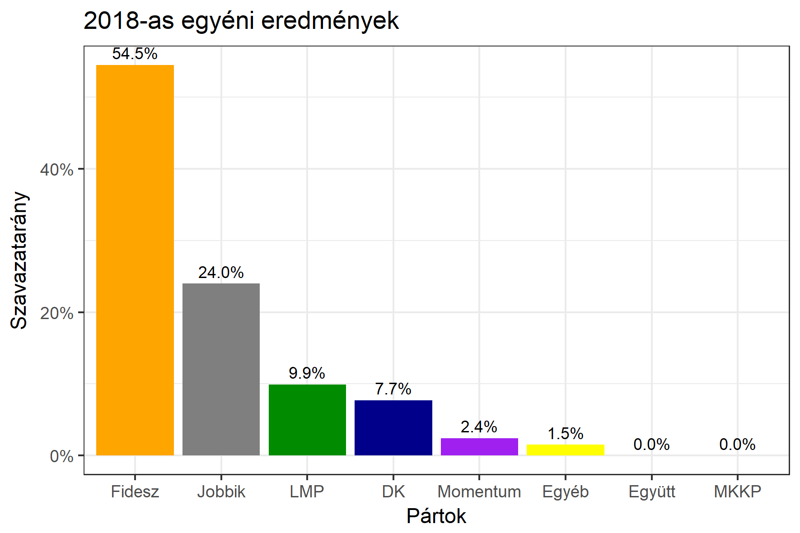

<h1 class="page-title">{{ page.title | escape }}</h1>

    

          

		  <h5>Bács-Kiskun megye 1-es választókerület (Kecskemét)</h5>
 <h5><strong>2018-as egyéni eredmények</strong></h5>  <table class="striped">
              <thead>
                <tr>
                    <th>Jelöltek</th>
                    <th>Szavazatarány (százalék)</th>
<th>Eltérés a becsléstől</th>
                </tr>
              </thead>
              <tbody>
             <tr>
                  <td>dr. Salacz László - Fidesz-KDNP </td>
				   <td id="id_fidesz">54.5%</td>
				   <td>+7.2%</td>
			</tr>
			<tr>
<td>Lejer Zoltán - Jobbik </td>
 <td id="id_jobbik">24.0%</td>
				   <td>-3.8%</td>
 </tr>
			<tr>
                  <td>Szőkéné Kopping Rita - DK </td>
				   <td id="id_baloldal">7.7%</td>
				   <td>-5.1%</td>
			</tr>
			<tr>
                  <td>Vágó Gábor - LMP </td>
				   <td id="id_lmp">9.9%</td>
				   <td>+0.3%</td>
			</tr>
			<tr>
				  <td>Szarvas Koppány Bendegúz - Momentum </td>
				   <td id="id_momentum">2.4%</td>
				   <td>-0.1%</td>
			</tr>
                
              </tbody>
            </table><h6><strong>Választókerületi profil (2014-ben): Biztos Fideszes</strong></h6>
 

 
			

          

    

    

          

		  <h5>Bács-Kiskun megye 1-es választókerület (Kecskemét) - 2014-es eredmények</h5>
            <table class="striped">
              <thead>
                <tr>
                    <th>Jelöltek</th>
                    <th>Szavazatarányok</th>
                </tr>
              </thead>
              <tbody>
             <tr>
                  <td>Dr. Salacz László - Fidesz-KDNP</td>
				  <td>51.3%</td>
			</tr>
			<tr>
			      <td>Gyöngyösi Márton Balázs - Jobbik</td>
				  <td>20.5%</td>

			</tr>
			<tr>
                  <td>Király József - Összefogás (MSZP-Együtt-DK-PM-MLP)</td>
				  <td>19.7%</td>
			</tr>
			<tr>
				  <td>Kriskó Dávid Gábor - LMP</td>
				  <td>5.3%</td>
			</tr>                
              </tbody>
            </table>
			<h5>Győztes: Fidesz-KDNP, 30.8%-kal</h5>
          

    

