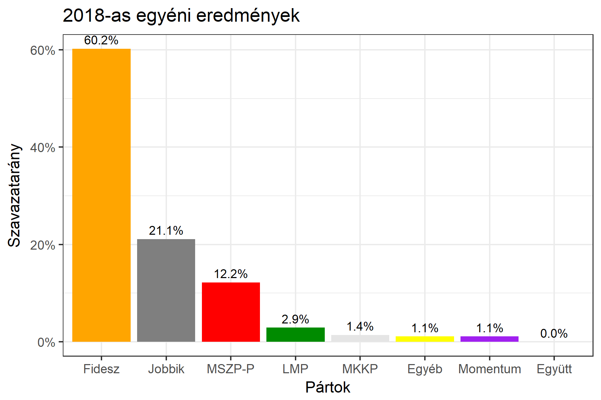

<h1 class="page-title">{{ page.title | escape }}</h1>

    

          

		  <h5>Bács-Kiskun megye 4-es választókerület (Kiskunfélegyháza)</h5>
 <h5><strong>2018-as egyéni eredmények</strong></h5>  <table class="striped">
              <thead>
                <tr>
                    <th>Jelöltek</th>
                    <th>Szavazatarány (százalék)</th>
<th>Eltérés a becsléstől</th>
                </tr>
              </thead>
              <tbody>
             <tr>
                  <td>Lezsák Sándor - Fidesz-KDNP </td>
				   <td id="id_fidesz">60.2%</td>
				   <td>+10.2%</td>
			</tr>
			<tr><td>Kollár László - Jobbik </td> 
			<td id="id_jobbik">21.1%</td>
				   <td>-7.5%</td>
			</tr>
<tr>
                  <td>Horváth Tamás - MSZP-Párbeszéd </td>
				  <td id="id_baloldal">12.2%</td>
				   <td>+0.0%</td>
			</tr>
			<tr>
                  <td>Kis-Szeniczey Kálmán - LMP </td>
				   <td id="id_lmp">2.9%</td>
				   <td>-1.8%</td>
			</tr>
			<tr>
				  <td>Tabajdi Péter - Momentum </td>
				   <td id="id_momentum">1.1%</td>
				   <td>-0.6%</td>
			</tr>
       
<tr>
<td>Bodor Sándor - MKKP </td>
 <td id="id_mkkp">1.4%</td>
				   <td>-1.5%</td>
</tr>            
              </tbody>
            </table><h6><strong>Választókerületi profil (2014-ben): Biztos Fideszes</strong></h6>
 

 
			

          

    

    

          

		  <h5>Bács-Kiskun megye 4-es választókerület (Kiskunfélegyháza) - 2014-es eredmények</h5>
            <table class="striped">
              <thead>
                <tr>
                    <th>Jelöltek</th>
                    <th>Szavazatarányok</th>
                </tr>
              </thead>
              <tbody>
             <tr>
                  <td>Lezsák Sándor István - Fidesz-KDNP</td>
				  <td>53.3%</td>
			</tr>
			<tr>
			      <td>Oberna Zoltán - Jobbik</td>
				  <td>21.4%</td>
			</tr>
			<tr>
			      <td>Laskovics Diána - Összefogás (MSZP-Együtt-DK-PM-MLP)</td>
				  <td>18.4%</td>
			</tr>
			<tr>
				  <td>Falusi Norbert - LMP</td>
				  <td>3.4%</td>
			</tr>                
              </tbody>
            </table>
			<h5>Győztes: Fidesz-KDNP, 31.9%-kal</h5>
          

    

