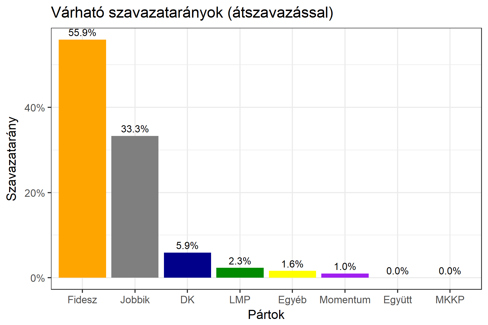

<h1 class="page-title">{{ page.title | escape }}</h1>

    

          

		  <h5>Bács-Kiskun megye 5-ös választókerület (Kiskunhalas)</h5>
 <h5><strong>2018-as egyéni eredmények</strong></h5>  <table class="striped">
              <thead>
                <tr>
                    <th>Jelöltek</th>
                    <th>Szavazatarány (százalék)</th>
<th>Eltérés a becsléstől</th>
                </tr>
              </thead>
              <tbody>
             <tr>
                  <td>Bányai Gábor - Fidesz-KDNP </td>
				   <td id="id_fidesz">55.9%</td>
				   <td>+6.2%</td>
			</tr>
			<tr><td>Farkas Gergely - Jobbik </td> 
			<td id="id_jobbik">33.3%</td>
				   <td>-1.8%</td>
			</tr>
<tr>
                  <td>Molnár László - DK </td>
				  <td id="id_baloldal">5.9%</td>
				   <td>-5.9%</td>
			</tr>
			<tr>
                  <td>Midi Melánia - LMP </td>
				  <td id="id_lmp">2.3%</td>
				   <td>-0.2%</td>
			</tr>
			<tr>
				  <td>Takács Zoltán - Momentum </td>
				  <td id="id_momentum">1.0%</td>
				   <td>+0.1%</td>
			</tr>
                
              </tbody>
            </table><h6><strong>Választókerületi profil (2014-ben): Biztos Fideszes</strong></h6>
 

 
			

          

    

    

          

		  <h5>Bács-Kiskun megye 5-ös választókerület (Kiskunhalas) - 2014-es eredmények</h5>
            <table class="striped">
              <thead>
                <tr>
                    <th>Jelöltek</th>
                    <th>Szavazatarányok</th>
                </tr>
              </thead>
              <tbody>
             <tr>
                  <td>Bányai Gábor Elemér - Fidesz-KDNP</td>
				  <td>51.3%</td>
			</tr>
			<tr>
			      <td>Farkas Gergely - Jobbik</td>
				  <td>24.5%</td>
			</tr>
			<tr>
			      <td>Török Zsolt Bernát - Összefogás (MSZP-Együtt-DK-PM-MLP)</td>
				  <td>18.5%</td>
			</tr>
			<tr>
				  <td>Lapos Péter - LMP</td>
				  <td>2.3%</td>
			</tr>                
              </tbody>
            </table>
			<h5>Győztes: Fidesz-KDNP, 26.8%-kal</h5>
          

    

