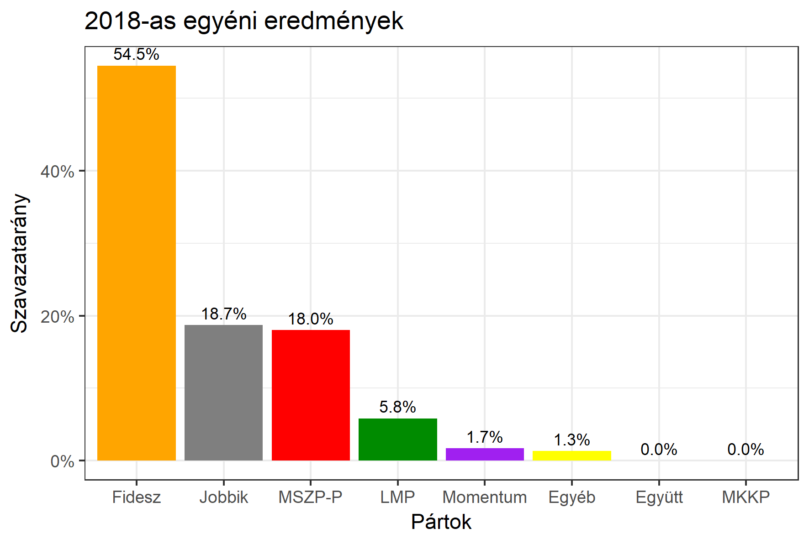

<h1 class="page-title">{{ page.title | escape }}</h1>

    

          

		  <h5>Bács-Kiskun megye 6-os választókerület (Baja)</h5>
 <h5><strong>2018-as egyéni eredmények</strong></h5>  <table class="striped">
              <thead>
                <tr>
                    <th>Jelöltek</th>
                    <th>Szavazatarány (százalék)</th>
<th>Eltérés a becsléstől</th>
                </tr>
              </thead>
              <tbody>
             <tr>
                  <td>Zsigó Róbert - Fidesz-KDNP </td>
				   <td id="id_fidesz">54.5%</td>
				   <td>+6.1%</td>
			</tr>
			<tr><td>Grünfelder Zoltán - Jobbik </td> 
			<td id="id_jobbik">18.7%</td>
				   <td>-0.1%</td>
			</tr>
<tr>
                  <td>Hajdú Miklós - MSZP-Párbeszéd </td>
				  <td id="id_baloldal">18.0%</td>
				   <td>-5.9%</td>
			</tr>
			<tr>
                  <td>Ikotity István - LMP </td>
				   <td id="id_lmp">5.8%</td>
				   <td>-1.3%</td>
			</tr>
			<tr>
				  <td>Béni Kornél - Momentum </td>
				   <td id="id_momentum">1.7%</td>
				   <td>-0.1%</td>
			</tr>
                
              </tbody>
            </table><h6><strong>Választókerületi profil (2014-ben): Biztos Fideszes</strong></h6>
 

 
			

          

    

    

          

		  <h5>Bács-Kiskun megye 6-os választókerület (Baja) - 2014-es eredmények</h5>
            <table class="striped">
              <thead>
                <tr>
                    <th>Jelöltek</th>
                    <th>Szavazatarányok</th>
                </tr>
              </thead>
              <tbody>
             <tr>
                  <td>Zsigó Róbert Vilmos - Fidesz-KDNP</td>
				  <td>49.7%</td>
			</tr>
			<tr>
			      <td>Teket Melinda - Összefogás (MSZP-Együtt-DK-PM-MLP)</td>
				  <td>25.6%</td>
			      
			</tr>
			<tr>
			      <td>Mészáros István - Jobbik</td>
				  <td>17.5%</td>
			</tr>
			<tr>
				  <td>Ikotity István - LMP</td>
				  <td>4.7%</td>
			</tr>                
              </tbody>
            </table>
			<h5>Győztes: Fidesz-KDNP, 24.1%-kal</h5>
          

    

