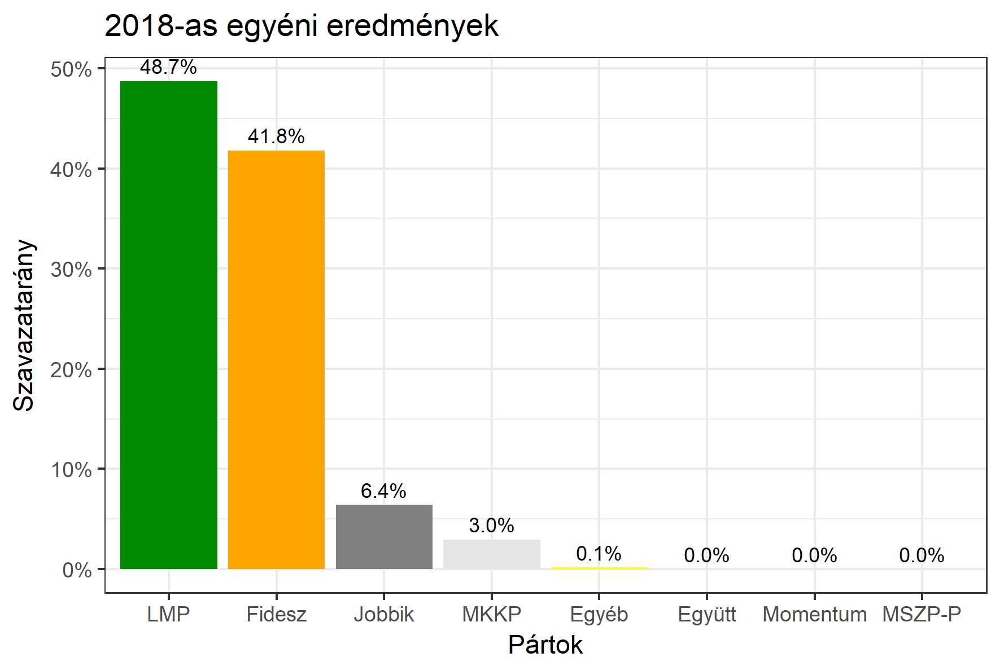

<h1 class="page-title">{{ page.title | escape }}</h1>

    

          

		  <h5>Budapest 1-es választókerület (V. kerület)</h5>
 <h5><strong>2018-as egyéni eredmények</strong></h5>  <table class="striped">
              <thead>
                <tr>
                    <th>Jelöltek</th>
                    <th>Szavazatarány (százalék)</th>
<th>Eltérés a becsléstől</th>
                </tr>
              </thead>
              <tbody>
             <tr>
                  <td>Hollik István  - Fidesz-KDNP </td>
				   <td id="id_fidesz">41.8%</td>
				   <td>+0.8%</td>
			</tr>
			<tr>
<td>Losonczy Pál - Jobbik </td>
 <td id="id_jobbik">6.4%</td>
 <td>+0.4%</td>
 </tr>
 <tr>
                  <td>Csárdi Antal - LMP </td>
				   <td id="id_lmp">48.7%</td>
				   <td>-1.3%</td>
			</tr>
<tr>
                  <td>Horváth András - MKKP </td>
				   <td id="id_mkkp">3.1%</td>
				   <td>+0.1%</td>
			</tr>			
              </tbody>
            </table><h6><strong>Választókerületi profil (2014-ben): Enyhén Fideszes (baloldali kihívó, erős az LMP)</strong></h6>
 

 
			

          

    

    

          

		  <h5>Budapest 1-es választókerület (V. kerület) - 2014-es eredmények</h5>
            <table class="striped">
              <thead>
                <tr>
                    <th>Jelöltek</th>
                    <th>Szavazatarányok</th>
                </tr>
              </thead>
              <tbody>
             <tr>
                  <td>Rogán Antal - Fidesz-KDNP</td>
				  <td>45.3%</td>
			</tr>
			<tr>
                  <td>Kerék-Bárczy Szabolcs - Összefogás (MSZP-Együtt-DK-PM-MLP)</td>
				  <td>32.6%</td>
			</tr>
			<tr>
                  <td>Schiffer András - LMP</td>
				  <td>13.7%</td>
			</tr>
			<tr>
				  <td>Hegedűs Lóránt Gézáné - Jobbik</td>
				  <td>7.8%</td>
			</tr>                
              </tbody>
            </table>
			<h5>Győztes: Fidesz-KDNP, 12.7%-kal</h5>
          

    

