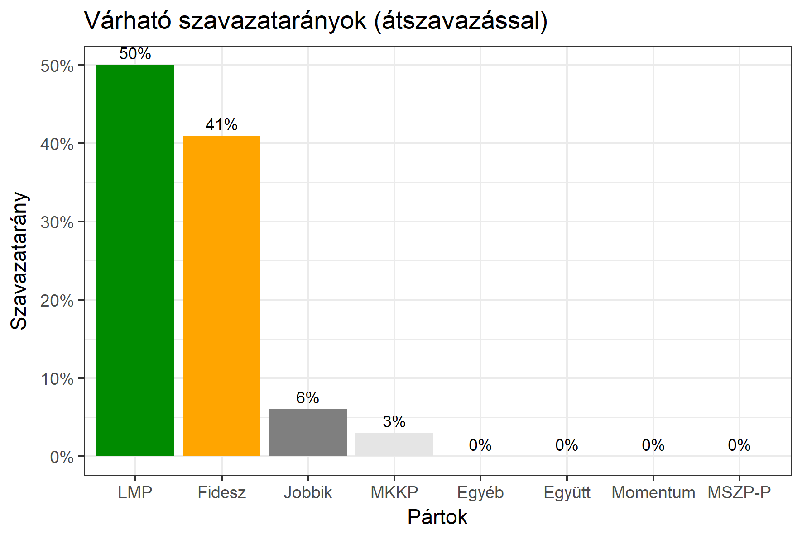

<h1 class="page-title">{{ page.title | escape }}</h1>

    

          
<h6><strong>A következő becslés várható időpontja: 2018. március 19.</strong></h6>
		  <h5>Budapest 1-es választókerület (V. kerület)</h5>
 <h6><strong>Választókerületi profil (2014-ben): Enyhén Fideszes (baloldali kihívó, erős az LMP)</strong></h6>
 
<h6><strong>Legfrissebb 2018-as becslések eredménye:</strong></h6>  
			<h5><strong>Legesélyesebb ellenzéki jelölt: MSZP-Párbeszéd/DK</strong></h5>
<table class="striped">
              <thead>
                <tr>
                    <th>Jelöltek</th>
                    <th>Várható szavazatarány egyéniben (átszavazással)</th>
                </tr>
              </thead>
              <tbody>
             <tr>
                  <td>Hollik István  - Fidesz-KDNP </td>
				  <td id="id_fidesz">41.4%</td>
			</tr>
			<tr>
<td>Losonczy Pál - Jobbik </td>
<td id="id_jobbik">5.5%</td></tr>
			<tr>
<td>Váradiné Naszály Márta - MSZP-Párbeszéd </td>
<td id="id_baloldal">22.5%</td></tr>
			<tr>
                  <td>Csárdi Antal - LMP </td>
				  <td id="lmp">15.5%</td>
			</tr>
			<tr>
				  <td>Fekete-Győr András - Momentum </td>
				  <td id="id_momentum">6.4%</td>
			</tr>
<tr>
                  <td>Juhász Péter - Együtt </td>
				  <td id="id_egyutt">6.2%</td>
			</tr>	
<tr>
                  <td>Horváth András - MKKP </td>
				  <td id="id_mkkp">2.4%</td>
			</tr>			
              </tbody>
            </table><h5>Várható győztes: Fidesz</h5>
			
			
 
<strong>Fontos:</strong> A becslések csak az egyéni jelöltre adott szavazatok arányát mutatják, nem a listás szavazatokét. A becslés jelentős eltérést mutathat a kisebb pártok esetében és olyan kerületekben, ahol nincs egyértelmű esélyes jelölt.

 
			
 <h6><strong>Becslés megbízhatósága a legesélyesebb jelöltről:</strong> <strong>Nem egyértelmű az esélyes - az esélyes jelölt még változhat</strong></h6>

Megjegyzés a kerülethez: A kerületben nagyon szétaprózódott az ellenzéki szavazatok száma, mert több erős jelölt is indul. Koordinált indulás nélkül egyik jelöltnek sincs esélye a mandátum megszerzésére.

Az aktuális becslés leírásáról <a href="../metodologia#0312">bővebben itt olvashatsz</a>.

          

    

    

          

		  <h5>Budapest 1-es választókerület (V. kerület) - 2014-es eredmények</h5>
            <table class="striped">
              <thead>
                <tr>
                    <th>Jelöltek</th>
                    <th>Szavazatarányok</th>
                </tr>
              </thead>
              <tbody>
             <tr>
                  <td>Rogán Antal - Fidesz-KDNP</td>
				  <td>45.3%</td>
			</tr>
			<tr>
                  <td>Kerék-Bárczy Szabolcs - Összefogás (MSZP-Együtt-DK-PM-MLP)</td>
				  <td>32.6%</td>
			</tr>
			<tr>
                  <td>Schiffer András - LMP</td>
				  <td>13.7%</td>
			</tr>
			<tr>
				  <td>Hegedűs Lóránt Gézáné - Jobbik</td>
				  <td>7.8%</td>
			</tr>                
              </tbody>
            </table>
			<h5>Győztes: Fidesz-KDNP, 12.7%-kal</h5>
          

    

