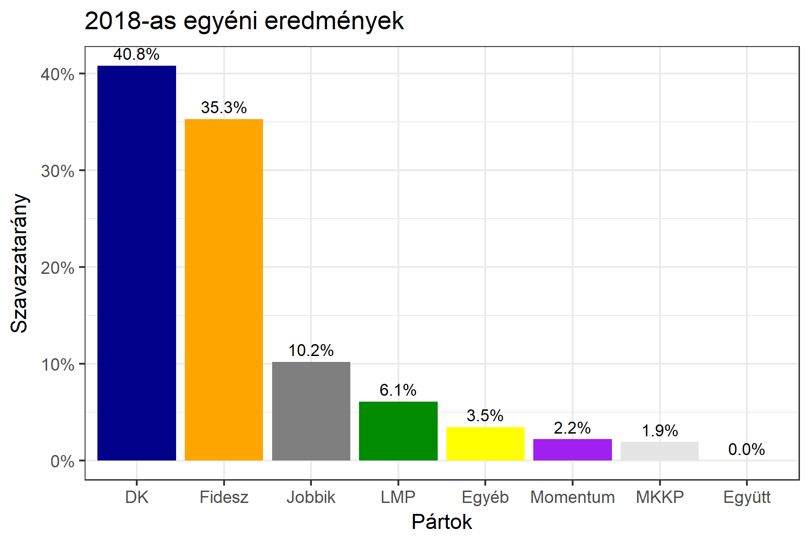

<h1 class="page-title">{{ page.title | escape }}</h1>

    

          

		  <h5>Budapest 11-es választókerület (IV. kerület)</h5>
 <h5><strong>2018-as egyéni eredmények</strong></h5>  <table class="striped">
              <thead>
                <tr>
                    <th>Jelöltek</th>
                    <th>Szavazatarány (százalék)</th>
<th>Eltérés a becsléstől</th>
                </tr>
              </thead>
              <tbody>
             <tr>
                  <td>dr. Zsigmond Barna Pál - Fidesz-KDNP </td>
				    <td id="id_fidesz">35.3%</td>
				   <td>+2.7%</td>
			</tr>
			<tr><td>Hegedűs Loránt Gézáné - Jobbik </td> 
			 <td id="id_jobbik">10.2%</td>
				   <td>+1.0%</td>
			</tr>
<tr>
                  <td>Varju László - DK </td>
				   <td id="id_baloldal">40.8%</td>
				   <td>-1.8%</td>
			</tr>
			<tr>
                  <td>Kanász-Nagy Máté - LMP </td>
				    <td id="id_lmp">6.1%</td>
				   <td>-1.8%</td>
			</tr>
			<tr>
				  <td>Molnár Tibor - Momentum </td>
				    <td id="id_momentum">2.2%</td>
				   <td>-1.2%</td>
			</tr>
<tr>                
<td>Paizs Miklós - MKKP </td>
					<td id="id_mkkp">1.9%</td>
				   <td>+0.0%</td>
</tr>  
              </tbody>
            </table><h6><strong>Választókerületi profil (2014-ben): Biztos baloldali</strong></h6>
 

 
			

          

    

    

          

		  <h5>Budapest 11-es választókerület (IV. kerület) - 2014. november 23-i időközi választás</h5>
            <table class="striped">
              <thead>
                <tr>
                    <th>Jelöltek</th>
                    <th>Szavazatarányok</th>
                </tr>
              </thead>
              <tbody>
             <tr>
                  <td>Horváth Imre - MSZP</td>
				  <td>50.5%</td>
			</tr>
			<tr>
                  <td>Dr. Hollósi Antal Gábor - Fidesz-KDNP</td>
				  <td>30.7%</td>
			</tr>
			<tr>
                  <td>Urbán Flórián - Jobbik</td>
				  <td>9.9%</td>
			</tr>
			<tr>
				  <td>Kanász-Nagy Máté - LMP</td>
				  <td>5.1%</td>
			</tr>                
              </tbody>
            </table>
			<h5>Győztes: MSZP, 19.8%-kal</h5>
          

    

    

          

		  <h5>Budapest 11-es választókerület (IV. kerület) - 2014-es eredmények</h5>
            <table class="striped">
              <thead>
                <tr>
                    <th>Jelöltek</th>
                    <th>Szavazatarányok</th>
                </tr>
              </thead>
              <tbody>
             <tr>
                  <td>Kiss Péter - Összefogás (MSZP-Együtt-DK-PM-MLP)</td>
				  <td>40.7%</td>
			</tr>
			<tr>
                  <td>Dr. Hollósi Antal Gábor - Fidesz-KDNP</td>
				  <td>35.3%</td>
			</tr>
			<tr>
                  <td>Zsiga-Kárpát Dániel Gábor - Jobbik</td>
				  <td>12.7%</td>
			</tr>
			<tr>
				  <td>Száraz Dorottya - LMP</td>
				  <td>7.6%</td>
			</tr>                
              </tbody>
            </table>
			<h5>Győztes: Összefogás, 5.4%-kal</h5>
          

    

