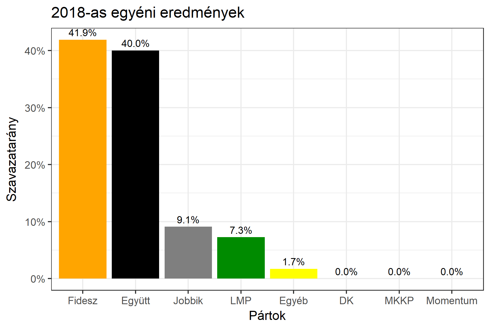

<h1 class="page-title">{{ page.title | escape }}</h1>

    

          

		  <h5>Budapest 13-as választókerület (XVI. kerület)</h5>
 <h5><strong>2018-as egyéni eredmények</strong></h5>  <table class="striped">
              <thead>
                <tr>
                    <th>Jelöltek</th>
                    <th>Szavazatarány (százalék)</th>
<th>Eltérés a becsléstől</th>
                </tr>
              </thead>
              <tbody>
             <tr>
                  <td>Szatmáry Kristóf - Fidesz-KDNP </td>
				    <td id="id_fidesz">41.9%</td>
				   <td>-1.1%</td>
			</tr>
			<tr><td>Tokody Marcell Gergely - Jobbik </td> 
			 <td id="id_jobbik">9.1%</td>
				   <td>-0.6%</td>
			</tr>
			<tr>
                  <td>Mizsei László - LMP </td>
				    <td id="id_lmp">7.3%</td>
				   <td>+0.0%</td>
			</tr>
<tr>
<td>Vajda Zoltán -  Együtt </td>
  <td id="id_egyutt">40.0%</td>
				   <td>+0.0%</td>
</tr>                
              </tbody>
            </table><h6><strong>Választókerületi profil (2014-ben): Kétesélyes (Fidesz és baloldal között)</strong></h6>
 

 
			

          

    

    

          

		  <h5>Budapest 13-as választókerület (XVI. kerület) - 2014-es eredmények</h5>
            <table class="striped">
              <thead>
                <tr>
                    <th>Jelöltek</th>
                    <th>Szavazatarányok</th>
                </tr>
              </thead>
              <tbody>
             <tr>
                  <td>Szatmáry Kristóf - Fidesz-KDNP</td>
				  <td>41.6%</td>
			</tr>
			<tr>
                  <td>Karácsony Gergely Szilveszter - Összefogás (MSZP-Együtt-DK-PM-MLP)</td>
				  <td>38.2%</td>
			</tr>
			<tr>
                  <td>Kredits Krisztina - Jobbik</td>
				  <td>11.3%</td>
			</tr>
			<tr>
				  <td>Mizsei László - LMP</td>
				  <td>6.2%</td>
			</tr>                
              </tbody>
            </table>
			<h5>Győztes: Fidesz-KDNP, 3.4%-kal</h5>
          

    

