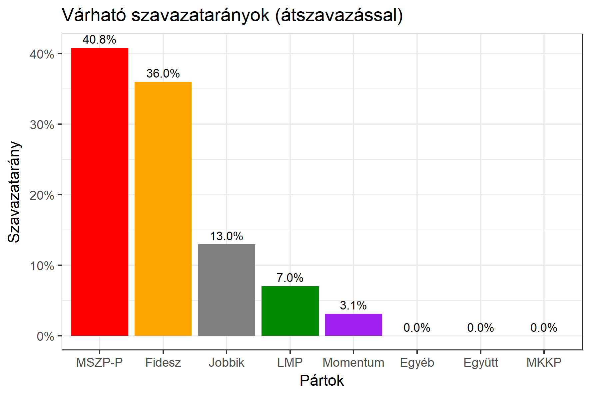

<h1 class="page-title">{{ page.title | escape }}</h1>

    

          

		  <h5>Budapest 16-os választókerület (XX. kerület)</h5>
 <h5><strong>2018-as egyéni eredmények</strong></h5>  <table class="striped">
              <thead>
                <tr>
                    <th>Jelöltek</th>
                    <th>Szavazatarány (százalék)</th>
<th>Eltérés a becsléstől</th>
                </tr>
              </thead>
              <tbody>
             <tr>
                  <td>Földesi Gyula - Fidesz-KDNP </td>
				    <td id="id_fidesz">37.3%</td>
				   <td>+1.3%</td>
			</tr>
			<tr><td>Bencsik János - Jobbik </td> 
			 <td id="id_jobbik">12.2%</td>
				   <td>-0.8%</td>
			</tr>
<tr>
                  <td>dr. Hiller István - MSZP-Párbeszéd </td>
				    <td id="id_baloldal">43.2%</td>
				   <td>+2.4%</td>
			</tr>
			<tr>
                  <td>Ferenczi István - LMP </td>
				    <td id="id_lmp">4.4%</td>
				   <td>-2.6%</td>
			</tr>
			<tr>
				  <td>Teveli Dalma - Momentum </td>
				   <td id="id_momentum">2.0%</td>
				   <td>-1.1%</td>
			</tr>               
              </tbody>
            </table><h6><strong>Választókerületi profil (2014-ben): Kétesélyes (Fidesz és baloldal között)</strong></h6>
 
<h5><strong>2018. április 8-i becslések (átszavazással):</strong></h5>  
			<h6><strong>Becslés megbízhatósága a legesélyesebb jelöltről:</strong> <strong>A baloldali jelölt az egyértelmű esélyes</strong></h6> 
<h5><strong>Legesélyesebb ellenzéki jelölt: dr. Hiller István (MSZP-Párbeszéd)</strong></h5>
<h5><strong><a href="https://rendszervaltas2018.hu">Márki-Zay Péter ajánlása</a>: dr. Hiller István (MSZP-Párbeszéd) </strong></h5>
<h5><strong><a href="https://www.v18.eu/53korzet">A V18 ajánlása</a>: dr. Hiller István (MSZP-Párbeszéd)</strong></h5>

  <table class="striped">
              <thead>
                <tr>
                    <th>Jelöltek</th>
                    <th>Várható szavazatarány egyéniben (zárójelben az arányok átszavazás esetén)</th>
                </tr>
              </thead>
              <tbody>
             <tr>
                  <td>Földesi Gyula - Fidesz-KDNP </td>
				   <td id="id_fidesz">35.1% &emsp; (36.0%)</td>
			</tr>
			<tr><td>Bencsik János - Jobbik </td> <td id="id_jobbik">16.9% &emsp; (13.0%)</td></tr>
<tr>
                  <td>dr. Hiller István - MSZP-Párbeszéd </td>
				   <td id="id_baloldal">29.0% &emsp; (40.8%)</td>
			</tr>
			<tr>
                  <td>Ferenczi István - LMP </td>
				   <td id="id_lmp">10.6% &emsp; (7.0%)</td>
			</tr>
			<tr>
				  <td>Teveli Dalma - Momentum </td>
				   <td id="id_momentum">4.7% &emsp; (3.1%)</td>
			</tr>               
              </tbody>
            </table><h5>Várható győztes: dr. Hiller István (MSZP-Párbeszéd)</h5>
			
			
 
<strong>Fontos:</strong> A becslések csak az egyéni jelöltre adott szavazatok arányát mutatják, nem a listás szavazatokét. A becslés jelentős eltérést mutathat a kisebb pártok esetében és olyan kerületekben, ahol nincs egyértelmű esélyes jelölt.

 
			

          

    

    

          

		  <h5>Budapest 16-os választókerület (XX. kerület) - 2014-es eredmények</h5>
            <table class="striped">
              <thead>
                <tr>
                    <th>Jelöltek</th>
                    <th>Szavazatarányok</th>
                </tr>
              </thead>
              <tbody>
             <tr>
			      <td>Dr. Hiller István - Összefogás (MSZP-Együtt-DK-PM-MLP)</td>
				  <td>38.4%</td> 
			</tr>
			<tr>
                 <td>Földesi Gyula - Fidesz-KDNP</td>
				 <td>36.3%</td>
			</tr>
			<tr>
                  <td>Tokody Marcell Gergely - Jobbik</td>
				  <td>15.4%</td>
			</tr>
			<tr>
				  <td>Ferenczi István - LMP</td>
				  <td>6.1%</td>
			</tr>                
              </tbody>
            </table>
			<h5>Győztes: Összefogás, 2.1%-kal</h5>
          

    

