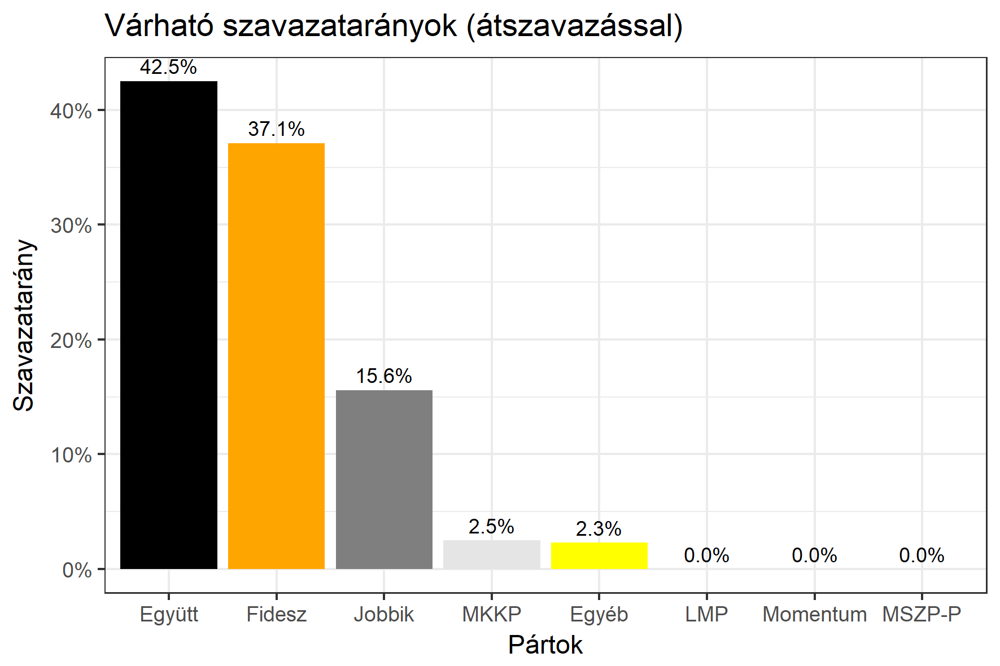

<h1 class="page-title">{{ page.title | escape }}</h1>

    

          

		  <h5>Budapest 17-es választókerület (XXI. kerület)</h5>
 <h5><strong>2018-as egyéni eredmények</strong></h5>  <table class="striped">
              <thead>
                <tr>
                    <th>Jelöltek</th>
                    <th>Szavazatarány (százalék)</th>
<th>Eltérés a becsléstől</th>
                </tr>
              </thead>
              <tbody>
             <tr>
                  <td>Németh Szilárd István - Fidesz-KDNP </td>
				    <td id="id_fidesz">37.1%</td>
				   <td>-0.9%</td>
			</tr>
			<tr><td>Bereczki Miklós - Jobbik </td> 
			 <td id="id_jobbik">15.6%</td>
				   <td>-0.2%</td>
			</tr>
<tr>
<td>dr. Szabó Szabolcs -  Együtt </td>
  <td id="id_egyutt">42.5%</td>
				   <td>-1.8%</td>
</tr>            
<tr>
<td>Soltész Szilvia Nikolett - MKKP </td>
  <td id="id_mkkp">2.5%</td>
				   <td>+0.6%</td>
</tr>    
              </tbody>
            </table><h6><strong>Választókerületi profil (2014-ben): Kétesélyes (Fidesz és baloldal között)</strong></h6>
 

 
			

          

    

    

          

		  <h5>Budapest 17-es választókerület (XXI. kerület) - 2014-es eredmények</h5>
            <table class="striped">
              <thead>
                <tr>
                    <th>Jelöltek</th>
                    <th>Szavazatarányok</th>
                </tr>
              </thead>
              <tbody>
             <tr>
			      <td>Dr. Szabó Szabolcs - Összefogás (MSZP-Együtt-DK-PM-MLP)</td>
				  <td>36.4%</td> 
			</tr>
			<tr>
                 <td>Németh Szilárd István - Fidesz-KDNP</td>
				 <td>35.5%</td>
			</tr>
			<tr>
                  <td>Léhmann Viktor - Jobbik</td>
				  <td>17.8%</td>
			</tr>
			<tr>
				  <td>Tenk András - LMP</td>
				  <td>6.0%</td>
			</tr>                
              </tbody>
            </table>
			<h5>Győztes: Összefogás, 0.9%-kal</h5>
          

    

