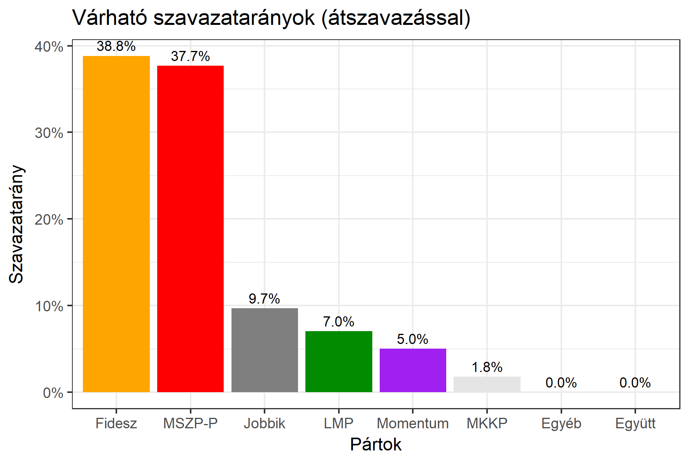

<h1 class="page-title">{{ page.title | escape }}</h1>

    

          

		  <h5>Budapest 18-as választókerület (XXII. kerület)</h5>
 <h5><strong>2018-as egyéni eredmények</strong></h5>  <table class="striped">
              <thead>
                <tr>
                    <th>Jelöltek</th>
                    <th>Szavazatarány (százalék)</th>
<th>Eltérés a becsléstől</th>
                </tr>
              </thead>
              <tbody>
             <tr>
                  <td>Németh Zsolt - Fidesz-KDNP </td>
				    <td id="id_fidesz">40.1%</td>
				   <td>+1.3%</td>
			</tr>
			<tr><td>Dr. Staudt Gábor - Jobbik </td> 
		 <td id="id_jobbik">9.2%</td>
				   <td>-0.5%</td>
			</tr>
<tr>
                  <td>Molnár Gyula - MSZP-Párbeszéd </td>
				   <td id="id_baloldal">41.5%</td>
				   <td>+3.8%</td>
			</tr>
			<tr>
                  <td>Pitz Dániel - LMP </td>
				 <td id="id_lmp">4.3%</td>
				   <td>-2.7%</td>
			</tr>
			<tr>
				  <td>Orosz Anna - Momentum </td>
				  <td id="id_momentum">2.8%</td>
				   <td>-2.2%</td>
			</tr>              
<tr>
<td>Hotz Antal - MKKP </td>
  <td id="id_mkkp">2.0%</td>
				   <td>+0.2%</td>
</tr>  
              </tbody>
            </table><h6><strong>Választókerületi profil (2014-ben): Enyhén Fideszes (baloldali kihívó)</strong></h6>
 
<h5><strong>2018. április 8-i becslések (átszavazással):</strong></h5>  
			<h6><strong>Becslés megbízhatósága a legesélyesebb jelöltről:</strong> <strong>A baloldali jelölt az egyértelmű esélyes</strong></h6> 
<h5><strong>Legesélyesebb ellenzéki jelölt: Molnár Gyula (MSZP-Párbeszéd)</strong></h5>
<h5><strong><a href="https://rendszervaltas2018.hu">Márki-Zay Péter ajánlása</a>: Molnár Gyula (MSZP-Párbeszéd) </strong></h5>
<h5><strong><a href="https://www.v18.eu/53korzet">A V18 ajánlása</a>: Molnár Gyula (MSZP-Párbeszéd)</strong></h5>

  <table class="striped">
              <thead>
                <tr>
                    <th>Jelöltek</th>
                    <th>Várható szavazatarány egyéniben (zárójelben az arányok átszavazás esetén)</th>
                </tr>
              </thead>
              <tbody>
             <tr>
                  <td>Németh Zsolt - Fidesz-KDNP </td>
				   <td id="id_fidesz">38.1% &emsp; (38.8%)</td>
			</tr>
			<tr><td>Dr. Staudt Gábor - Jobbik </td> <td id="id_jobbik">12.7% &emsp; (9.8%)</td></tr>
<tr>
                  <td>Molnár Gyula - MSZP-Párbeszéd </td>
				   <td id="id_baloldal">26.4% &emsp; (37.7%)</td>
			</tr>
			<tr>
                  <td>Pitz Dániel - LMP </td>
				   <td id="id_lmp">10.6% &emsp; (7.0%)</td>
			</tr>
			<tr>
				  <td>Orosz Anna - Momentum </td>
				   <td id="id_momentum">7.6% &emsp; (5.0%)</td>
			</tr>              
<tr>
<td>Hotz Antal - MKKP </td>
 <td id="id_mkkp">2.2% &emsp; (1.8%)</td>
</tr>  
              </tbody>
            </table><h5>Várható győztes: Fidesz-KDNP</h5>
			
			
 
<strong>Fontos:</strong> A becslések csak az egyéni jelöltre adott szavazatok arányát mutatják, nem a listás szavazatokét. A becslés jelentős eltérést mutathat a kisebb pártok esetében és olyan kerületekben, ahol nincs egyértelmű esélyes jelölt.

 
			

          

    

    

          

		  <h5>Budapest 18-as választókerület (XXII. kerület) - 2014-es eredmények</h5>
            <table class="striped">
              <thead>
                <tr>
                    <th>Jelöltek</th>
                    <th>Szavazatarányok</th>
                </tr>
              </thead>
              <tbody>
             <tr>
                  <td>Szabolcs Attila - Fidesz-KDNP</td>
				  <td>41.6%</td>
			</tr>
			<tr>
                  <td>Somfai Ágnes - Összefogás (MSZP-Együtt-DK-PM-MLP)</td>
				  <td>36.9%</td>
			</tr>
			<tr>
                  <td>Dr. Staudt Gábor - Jobbik</td>
				  <td>12.2%</td>
			</tr>
			<tr>
				  <td>Gecsei-Tóth Andrea - LMP</td>
				  <td>6.5%</td>
			</tr>                
              </tbody>
            </table>
			<h5>Győztes: Fidesz-KDNP, 4.7%-kal</h5>
          

    

