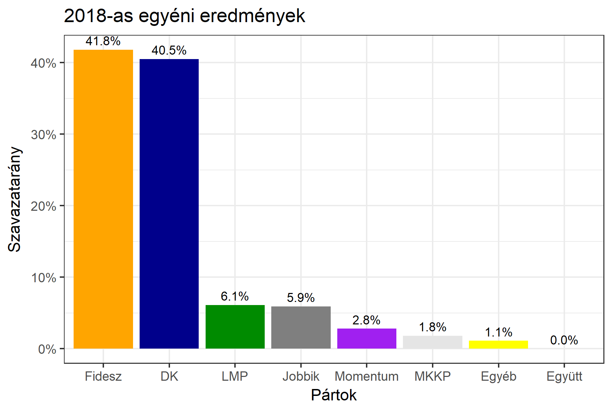

<h1 class="page-title">{{ page.title | escape }}</h1>

    

          

		  <h5>Budapest 2-es választókerület (XI. kerület)</h5>
 <h5><strong>2018-as egyéni eredmények</strong></h5>  <table class="striped">
              <thead>
                <tr>
                    <th>Jelöltek</th>
                    <th>Szavazatarány (százalék)</th>
<th>Eltérés a becsléstől</th>
                </tr>
              </thead>
              <tbody>
             <tr>
                  <td>dr. Simicskó István - Fidesz-KDNP </td>
				   <td id="id_fidesz">41.8%</td>
				   <td>-0.1%</td>
			</tr>
			<tr><td>Dr. Bardócz-Tódor András - Jobbik </td> 
					<td id="id_jobbik">5.9%</td>
				   <td>-0.3%</td></tr>
<tr>
                  <td>Gy. Németh Erzsébet - DK </td>
				   <td id="id_baloldal">40.5%</td>
				   <td>+3.7%</td>
			</tr>
			<tr>
                  <td>Kreitler-Sas Máté - LMP </td>
				   <td id="id_lmp">6.1%</td>
				   <td>-3.0%</td>
			</tr>
			<tr>
				  <td>Bedő Dávid - Momentum </td>
				   <td id="id_momentum">2.8%</td>
				   <td>-1.1%</td>
			</tr>            
<tr>
                  <td>Fischer Roland - MKKP </td>
				   <<<td id="id_mkkp">1.8%</td>
				   <td>-0.3%</td>
			</tr>		
              </tbody>
            </table><h6><strong>Választókerületi profil (2014-ben): Enyhén Fideszes (baloldali kihívó)</strong></h6>
 

 
			

          

    

    

          

		  <h5>Budapest 2-es választókerület (XI. kerület) - 2014-es eredmények</h5>
            <table class="striped">
              <thead>
                <tr>
                    <th>Jelöltek</th>
                    <th>Szavazatarányok</th>
                </tr>
              </thead>
              <tbody>
             <tr>
                  <td>Dr. Simicskó István - Fidesz-KDNP</td>
				  <td>44.8%</td>
			</tr>
			<tr>
                  <td>Dr. Józsa István - Összefogás (MSZP-Együtt-DK-PM-MLP)</td>
				  <td>36.7%</td>
			</tr>
			<tr>
                  <td>Csárdi Antal - LMP</td>
				  <td>8.6%</td>
			</tr>
			<tr>
				  <td>Novák Előd Attila - Jobbik</td>
				  <td>8.0%</td>
			</tr>                
              </tbody>
            </table>
			<h5>Győztes: Fidesz-KDNP, 8.1%-kal</h5>
          

    

