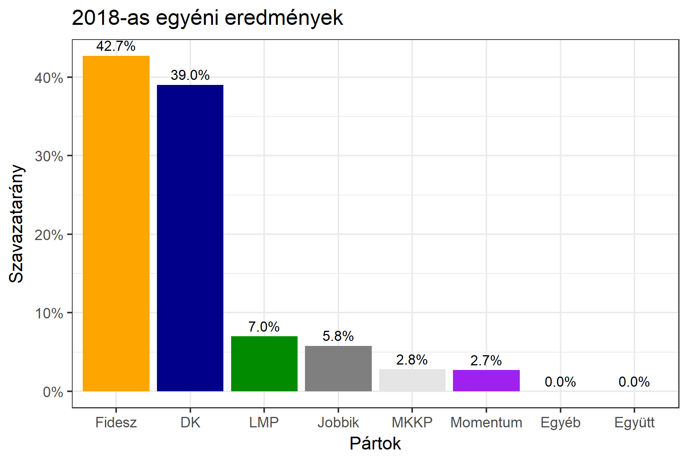

<h1 class="page-title">{{ page.title | escape }}</h1>

    

          

		  <h5>Budapest 3-as választókerület (XII. kerület)</h5>
 <h5><strong>2018-as egyéni eredmények</strong></h5>  <table class="striped">
              <thead>
                <tr>
                    <th>Jelöltek</th>
                    <th>Szavazatarány (százalék)</th>
					<th>Eltérés a becsléstől</th>
                </tr>
              </thead>
              <tbody>
             <tr>
                  <td>dr. Gulyás Gergely - Fidesz-KDNP </td>
				  <td id="id_fidesz">42.7%</td>
				   <td>+2.6%</td>
			</tr>
			<tr><td>Gyöngyösi Márton - Jobbik </td>  
			<td id="id_jobbik">5.8%</td>
				   <td>-0.6%</td></tr>
<tr>
                  <td>Bauer Tamás - DK </td>
				    <td id="id_baloldal">39.0%</td>
				   <td>+7.4%</td>
			</tr>
			<tr>
                  <td>Hajdu Mária - LMP </td>
				    <td id="id_lmp">7.0%</td>
				   <td>-5.3%</td>
			</tr>
			<tr>
				  <td>Kádár Barnabás Áron - Momentum </td>
				    <td id="id_momentum">2.7%</td>
				   <td>-2.4%</td>
			</tr>               
<tr>
                  <td>Kovács Gergely - MKKP </td>
				   <td id="id_mkkp">2.8%</td>
				   <td>-1.6%</td>
			</tr>		
              </tbody>
            </table><h6><strong>Választókerületi profil (2014-ben): Enyhén Fideszes (baloldali kihívó, erős az LMP)</strong></h6>
 

 
			

          

    

    

          

		  <h5>Budapest 3-as választókerület (XII. kerület) - 2014-es eredmények</h5>
            <table class="striped">
              <thead>
                <tr>
                    <th>Jelöltek</th>
                    <th>Szavazatarányok</th>
                </tr>
              </thead>
              <tbody>
             <tr>
                  <td>Dr. Fónagy János Vilmos - Fidesz-KDNP</td>
				  <td>46.8%</td>
			</tr>
			<tr>
                  <td>Bauer Tamás - Összefogás (MSZP-Együtt-DK-PM-MLP)</td>
				  <td>35.0%</td>
			</tr>
			<tr>
                  <td>Hajdu Mária - LMP</td>
				  <td>10.1%</td>
			</tr>
			<tr>
				  <td>Szávay István - Jobbik</td>
				  <td>6.1%</td>
			</tr>                
              </tbody>
            </table>
			<h5>Győztes: Fidesz-KDNP, 11.8%-kal</h5>
          

    

