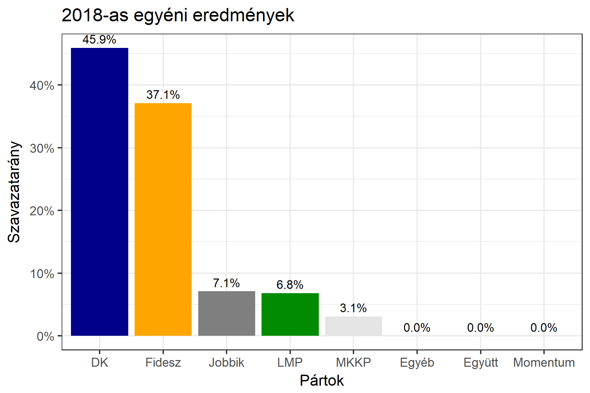

<h1 class="page-title">{{ page.title | escape }}</h1>

    

          

		  <h5>Budapest 5-ös választókerület (VII. kerület)</h5> 
 <h5><strong>2018-as egyéni eredmények</strong></h5>  <table class="striped"> 
              <thead>
                <tr>
                    <th>Jelöltek</th>
                    <th>Szavazatarány (százalék)</th>
<th>Eltérés a becsléstől</th>
                </tr>
              </thead>
              <tbody>
             <tr>
                  <td>Bajkai István - Fidesz-KDNP </td>
				    <td id="id_fidesz">37.1%</td>
				   <td>+4.7%</td>
			</tr>
			<tr><td>Stummer János - Jobbik </td>  
			<td id="id_jobbik">7.1%</td>
				   <td>-0.5%</td>
				   </tr>
<tr>
                  <td>Dr. Oláh Lajos - DK </td>
					<td id="id_baloldal">45.9%</td>
				   <td>+5.9%</td>
			</tr>
			<tr>
                  <td>Moldován László - LMP </td>
				    <td id="id_lmp">6.8%</td>
				   <td>-8.3%</td>
			</tr>
<tr>
<td>Döme Zsuzsanna - MKKP </td>
					<td id="id_mkkp">3.1%</td>
				   <td>-1.8%</td>
</tr>       
              </tbody>
            </table><h6><strong>Választókerületi profil (2014-ben): Enyhén baloldali (erős az LMP)</strong></h6>
 

 
			

          

    

    

          

		  <h5>Budapest 5-ös választókerület (VII. kerület) - 2014-es eredmények</h5>
            <table class="striped">
              <thead>
                <tr>
                    <th>Jelöltek</th>
                    <th>Szavazatarányok</th>
                </tr>
              </thead>
              <tbody>
             <tr>
                  <td>Dr. Oláh Lajos - Összefogás (MSZP-Együtt-DK-PM-MLP)</td>
				  <td>38.7%</td>
			</tr>
			<tr>
                  <td>Rónaszékiné Keresztes Monika Mária - Fidesz-KDNP</td>
				  <td>38.1%</td>
			</tr>
			<tr>
                  <td>Csiba Katalin Gyöngyvér - LMP</td>
				  <td>12.0%</td>
			</tr>
			<tr>
				  <td>Stummer János - Jobbik</td>
				  <td>10.5%</td>
			</tr>                
              </tbody>
            </table>
			<h5>Győztes: Összefogás, 0.6%-kal</h5>
          

    

