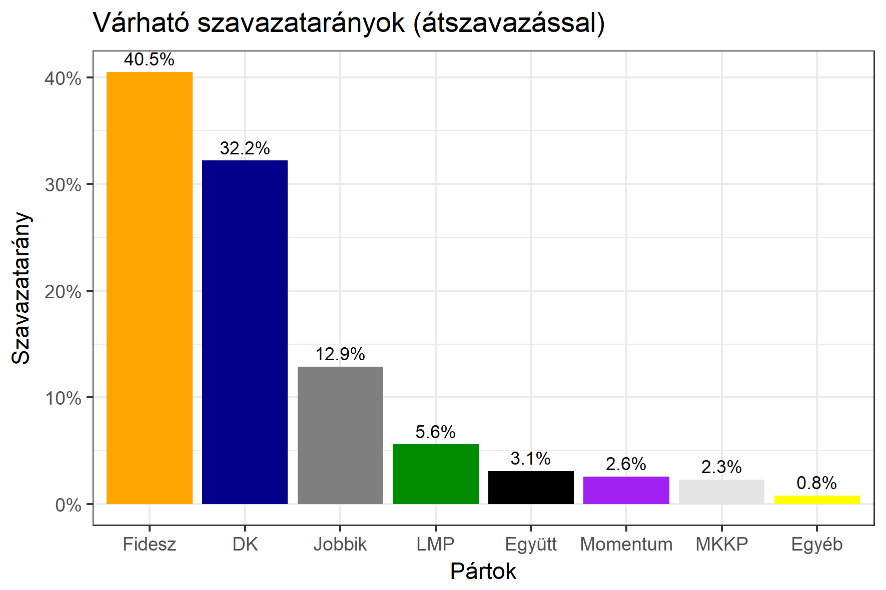

<h1 class="page-title">{{ page.title | escape }}</h1>

    

          

		  <h5>Budapest 6-os választókerület (VIII. kerület)</h5>
 <h5><strong>2018-as egyéni eredmények</strong></h5>  <table class="striped">
              <thead>
                <tr>
                    <th>Jelöltek</th>
                    <th>Szavazatarány (százalék)</th>
<th>Eltérés a becsléstől</th>
                </tr>
              </thead>
              <tbody>
             <tr>
                  <td>Kocsis Máté - Fidesz-KDNP </td>
				    <td id="id_fidesz">40.5%</td>
				   <td>+7.4%</td>
			</tr>
			<tr><td>Dúró Dóra - Jobbik </td> 
			 <td id="id_jobbik">12.9%</td>
				   <td>+1.3%</td>
			</tr>
<tr>
                  <td>Ara-Kovács Attila - DK </td>
				    <td id="id_baloldal">32.2%</td>
				   <td>-3.3%</td>
			</tr>
			<tr>
                  <td>Jakabfy Tamás - LMP </td>
				    <td id="id_lmp">5.6%</td>
				   <td>-2.6%</td>
			</tr>
			<tr>
				  <td>Dr. Cseh Katalin - Momentum </td>
				    <td id="id_momentum">2.6%</td>
				   <td>-2.6%</td>
			</tr>
<tr>
<td>Baranyi Krisztina -  Együtt </td>
			<td id="id_egyutt">3.1%</td>
				   <td>-1.4%</td>
</tr>    
<tr>
<td>Racskó Gábor - MKKP </td>
				<td id="id_mkkp">2.3%</td>
				   <td>+0.4%</td>
</tr>             
              </tbody>
            </table><h6><strong>Választókerületi profil (2014-ben): Kétesélyes (Fidesz és baloldal között)</strong></h6>
 

 
			

          

    

    

          

		  <h5>Budapest 6-os választókerület (VIII. kerület) - 2014-es eredmények</h5>
            <table class="striped">
              <thead>
                <tr>
                    <th>Jelöltek</th>
                    <th>Szavazatarányok</th>
                </tr>
              </thead>
              <tbody>
             <tr>
                  <td>Dr. Vas Imre - Fidesz-KDNP</td>
				  <td>38.3%</td>
			</tr>
			<tr>
                  <td>Pál Tibor Gyula - Összefogás (MSZP-Együtt-DK-PM-MLP)</td>
				  <td>37.0%</td>
			</tr>
			<tr>
                  <td>Dúró Dóra - Jobbik</td>
				  <td>13.3%</td>
			</tr>
			<tr>
				  <td>Jakabfy Tamás - LMP</td>
				  <td>8.3%</td>
			</tr>                
              </tbody>
            </table>
			<h5>Győztes: Fidesz-KDNP, 1.3%-kal</h5>
          

    

