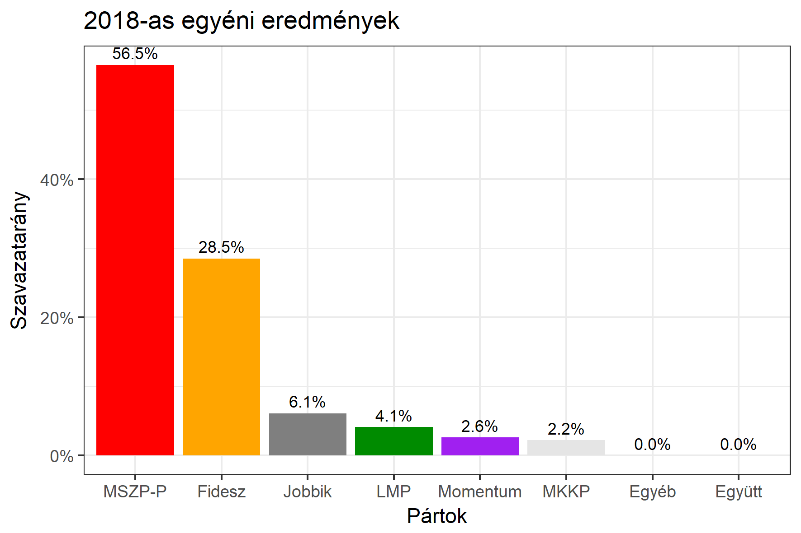

<h1 class="page-title">{{ page.title | escape }}</h1>

    

          

		  <h5>Budapest 7-es választókerület (XIII. kerület)</h5>
 <h5><strong>2018-as egyéni eredmények</strong></h5>  <table class="striped">
              <thead>
                <tr>
                    <th>Jelöltek</th>
                    <th>Szavazatarány (százalék)</th>
<th>Eltérés a becsléstől</th>
                </tr>
              </thead>
              <tbody>
             <tr>
                  <td>Harrach Tamás - Fidesz-KDNP </td>
				    <td id="id_fidesz">28.5%</td>
				   <td>-0.4%</td>
			</tr>
			<tr><td>Magvasi Adrián - Jobbik </td> 
			 <td id="id_jobbik">6.1%</td>
				   <td>-0.8%</td>
			</tr>
<tr>
                  <td>Hiszékeny Dezső - MSZP-Párbeszéd </td>
				    <td id="id_baloldal">56.5%</td>
				   <td>+10.1%</td>
			</tr>
			<tr>
                  <td>Kerékgyártó István - LMP </td>
				    <td id="id_lmp">4.1%</td>
				   <td>-3.7%</td>
			</tr>
			<tr>
				  <td>Hajnal Miklós - Momentum </td>
				   <td id="id_momentum">2.6%</td>
				   <td>-0.8%</td>
			</tr>
 
<tr>
<td>Sebő Ferenc - MKKP </td>
				<td id="id_mkkp">2.2%</td>
				   <td>-2.0%</td>
</tr>               
              </tbody>
            </table><h6><strong>Választókerületi profil (2014-ben): Biztos baloldali</strong></h6>
 

 
			

          

    

    

          

		  <h5>Budapest 7-es választókerület (XIII. kerület) - 2014-es eredmények</h5>
            <table class="striped">
              <thead>
                <tr>
                    <th>Jelöltek</th>
                    <th>Szavazatarányok</th>
                </tr>
              </thead>
              <tbody>
             <tr>
                 <td>Hiszékeny Dezső - Összefogás (MSZP-Együtt-DK-PM-MLP)</td>
				 <td>51.3%</td>
			</tr>
			<tr> <td>Dr. Szalay Péter - Fidesz-KDNP</td>
				 <td>30.7%</td>
                  
			</tr>
			<tr>
                  <td>Benke László - Jobbik</td>
				  <td>8.6%</td>
			</tr>
			<tr>
				  <td>Moldován László - LMP</td>
				  <td>7.1%</td>
			</tr>                
              </tbody>
            </table>
			<h5>Győztes: Összefogás, 20.6%-kal</h5>
          

    

