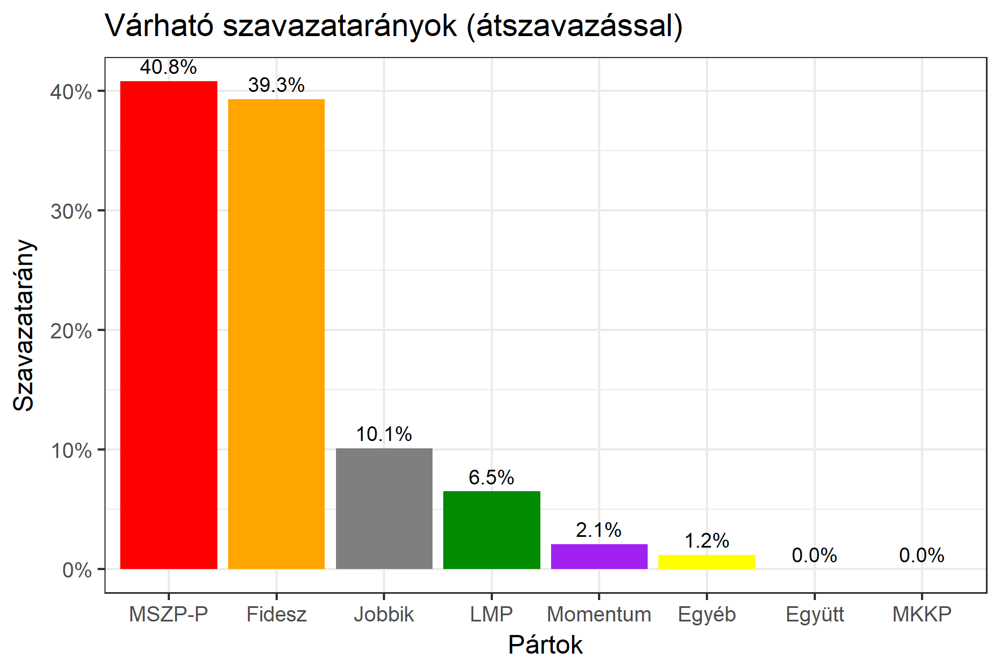

<h1 class="page-title">{{ page.title | escape }}</h1>

    

          

		  <h5>Budapest 9-es választókerület (X. kerület)</h5>
 <h5><strong>2018-as egyéni eredmények</strong></h5>  <table class="striped">
              <thead>
                <tr>
                    <th>Jelöltek</th>
                    <th>Szavazatarány (százalék)</th>
<th>Eltérés a becsléstől</th>
                </tr>
              </thead>
              <tbody>
             <tr>
                  <td>György István - Fidesz-KDNP </td>
				    <td id="id_fidesz">39.3%</td>
				   <td>+3.3%</td>
			</tr>
			<tr><td>Tubák István - Jobbik </td> 
			 <td id="id_jobbik">10.1%</td>
				   <td>-1.3%</td>
			</tr>
<tr>
                  <td>Burány Sándor - MSZP-Párbeszéd </td>
				    <td id="id_baloldal">40.8%</td>
				   <td>+0.9%</td>
			</tr>
			<tr>
                  <td>Demeter Márta - LMP </td>
				    <td id="id_lmp">6.5%</td>
				   <td>-2.9%</td>
			</tr>
			<tr>
				  <td>Tölcsér Borbála - Momentum </td>
				   <td id="id_momentum">2.1%</td>
				   <td>-1.2%</td>
			</tr>
         
       
              </tbody>
            </table><h6><strong>Választókerületi profil (2014-ben): Kétesélyes (Fidesz és baloldal között)</strong></h6>
 

 
			

          

    

    

          

		  <h5>Budapest 9-es választókerület (X. kerület) - 2014-es eredmények</h5>
            <table class="striped">
              <thead>
                <tr>
                    <th>Jelöltek</th>
                    <th>Szavazatarányok</th>
                </tr>
              </thead>
              <tbody>
             <tr>
                 <td>Burány Sándor - Összefogás (MSZP-Együtt-DK-PM-MLP)</td>
				 <td>38.8%</td>
			</tr>
			<tr> <td>Dr. György István - Fidesz-KDNP</td>
				 <td>37.5%</td>
                  
			</tr>
			<tr>
                  <td>Tubák István - Jobbik</td>
				  <td>13.9%</td>
			</tr>
			<tr>
				  <td>Tóth Balázs - LMP</td>
				  <td>6.7%</td>
			</tr>                
              </tbody>
            </table>
			<h5>Győztes: Összefogás, 1.3%-kal</h5>
          

    

