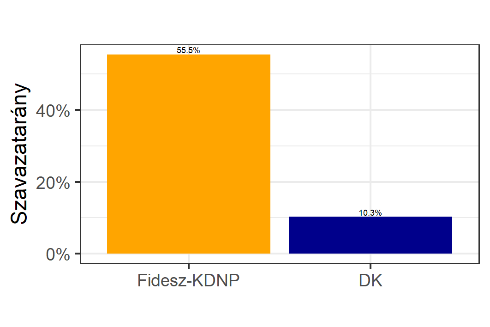

<h1 class="page-title">{{ page.title | escape }}</h1>

    

          

		  <h5>Budapest I. kerület</h5>
 <h5><strong>2014-es polgármester választás eredménye</strong></h5>  

<table class="striped">
              <thead>
                <tr>
                    <th>Jelöltek (első két helyezett)</th>
                    <th>Szavazatarány (százalék)</th>
					<th>Szavazatok száma<th>
                </tr>
              </thead>
              <tbody>
             <tr>
                  <td>	Dr. Nagy Gábor Tamás </td>
				   <td id="id_fidesz">55.5%</td>
				   <td id="id_fidesz2">5,914</td>
			</tr>
			<tr><td>Dr. Kakuk György András - DK </td> 
			<td id="id_masodik">10.3%</td>
			<td id="id_masodik_2">1,095</td>
			</tr>
             
   
              </tbody>
            </table>
 

 <h5><strong>2018-as országos listás eredmények</strong></h5>  

<table class="striped">
              <thead>
                <tr>
                    <th>Pártok</th>
                    <th>Szavazatarány (százalék)</th>
                </tr>
              </thead>
              <tbody>
             <tr>
                  <td>Fidesz </td>
				   <td id="id_fidesz">42.8%</td>
			</tr>
			<tr><td>Jobbik </td> 
			<td id="id_jobbik">7.7%</td>
			</tr>
			<tr>
                  <td>MSZP-Párbeszéd </td>
				   <td id="id_mszp">14.9%</td>
			</tr>
			<tr>
                  <td>LMP </td>
				   <td id="id_lmp">14.8%</td>
			</tr>
			<tr>
                  <td>DK </td>
				   <td id="id_dk">6.4%</td>
			</tr>
			<tr>
                  <td>Momentum </td>
				   <td id="id_momentum">7.5%</td>
			</tr>
             <tr>
                  <td>MKKP </td>
				   <td id="id_mkkp">3.2%</td>
			</tr>
   
              </tbody>
            </table>
          

    

