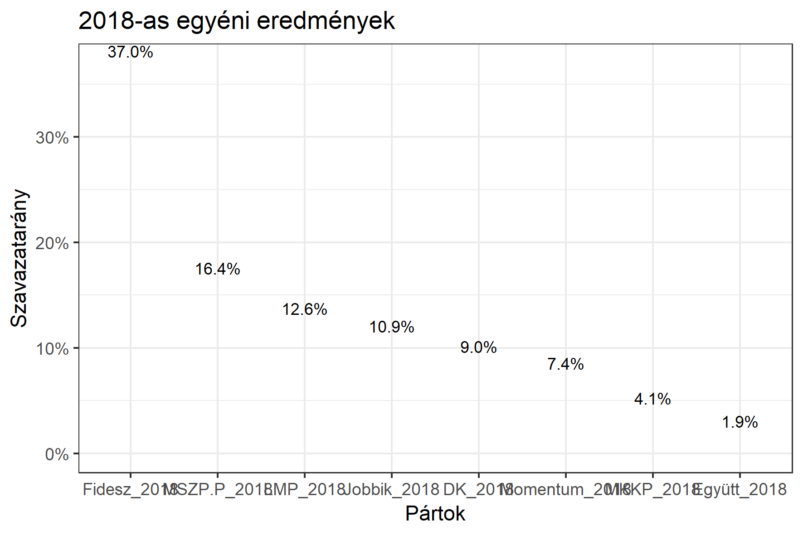

<h1 class="page-title">{{ page.title | escape }}</h1>

    

          

		  <h5>Budapest VII. kerület</h5>
 
<h5><strong><a id="webURL" href="http://www.valasztas.hu/dyn/onk14/szavossz/hu/M01/T007/tjk.html">2014-es polgármester-választás eredménye</a></strong></h5>
 

<iframe src="https://datastudio.google.com/embed/reporting/1cNSVSA70K2eq3LFj1NolaTdcqjgr9eKE/page/3Pym" frameborder="0" style="position: absolute;width: 100%;/* object-fit: contain; */height: 100%;top: 0;left: 0;right: 0;bottom: 0;" allowfullscreen=""></iframe>

			<table class="striped">
              <thead>
                <tr>
                    <th>Jelöltek (első két helyezett)</th>
                    <th>Szavazatarány (százalék)</th>
					<th>Szavazatok száma</th>
                </tr>
              </thead>
              <tbody>
             <tr>
                   <td>Vattamány András Zsolt - Fidesz-KDNP </td>
				   <td id="fidesz_mayor">44.2%</td>
				   <td id="fidesz_mayor2">7,089</td>
			</tr>
			<tr>
			<td>Farkas Ferenc - DK </td> 
			<td id="ellenzek_mayor">32.1%</td>
			<td id="ellenzek_mayor2">5,153</td>
			</tr>
              </tbody>
            </table>
 

 

<h5><strong>2014-es önkormányzati választáson nyert egyéni képviselőhelyek száma</strong></h5>  

<table class="striped">
              <thead>
                <tr>
                    <th>Pártok</th>
                    <th>Egyéni képviselőhelyek</th>
<th>Kompenzációs helyek</th>
                </tr>
              </thead>
              <tbody>
             <tr>
                  <td>Fidesz-KDNP </td>
				   <td id="fidesz_mp">7</td><td id="fidesz_mp_lista">1</td>
			</tr>
			<tr><td>Jobbik </td>
				<td id="jobbik_mp">0</td><td id="jobbik_mp_lista">1</td>
			</tr>
			<tr>
                  <td>MSZP </td>
				   <td id="mszp_mp">0</td><td id="mszp_mp_lista">0</td>
			</tr>
			<tr>
                  <td>LMP </td>
				   <td id="lmp_mp">0</td><td id="lmp_mp_lista">1</td>
			</tr>
			<tr>
                  <td>DK </td>
				   <td id="dk_mp">5 *</td><td id="dk_mp_lista">2</td>
			</tr>
			<tr>
                  <td>Együtt-PM </td>
				   <td id="egyutt_mp">0</td><td id="egyutt_mp_lista">0</td>
			</tr>
			 <tr>
                  <td>Egyéb szervezet</td>
				   <td id="egyeb_mp">0</td><td id="egyeb_mp_lista">0</td>
			</tr>
             <tr>
                  <td>Független</td>
				   <td id="fuggetlen_mp">0</td><td id="fuggetlen_mp_lista">0</td>
			</tr>
   
              </tbody>
            </table>

* DK-MSZP-EGYÜTT-FÜGE-PM-EEE közös jelölt 

 <h5><strong>2018-as országos listás eredmények</strong></h5>  

			<table class="striped">
              <thead>
                <tr>
                    <th>Pártok</th>
                    <th>Szavazatarány (százalék)</th>
                </tr>
              </thead>
              <tbody>
             <tr>
                  <td>Fidesz </td>
				   <td id="fidesz_2018">37.0%</td>
			</tr>
			<tr><td>Jobbik </td> 
			<td id="jobbik_2018">10.9%</td>
			</tr>
			<tr>
                  <td>MSZP-Párbeszéd </td>
				   <td id="mszp_2018">16.4%</td>
			</tr>
			<tr>
                  <td>LMP </td>
				   <td id="lmp_2018">12.6%</td>
			</tr>
			<tr>
                  <td>DK </td>
				   <td id="dk_2018">9.0%</td>
			</tr>
			<tr>
                  <td>Momentum </td>
				   <td id="momentum_2018">7.4%</td>
			</tr>
			<tr>
                  <td>Együtt </td>
				   <td id="egyutt_2018">1.9%</td>
			</tr>
             <tr>
                  <td>MKKP </td>
				   <td id="mkkp_2018">4.1%</td>
			</tr>
   
              </tbody>
            </table>
          

    

