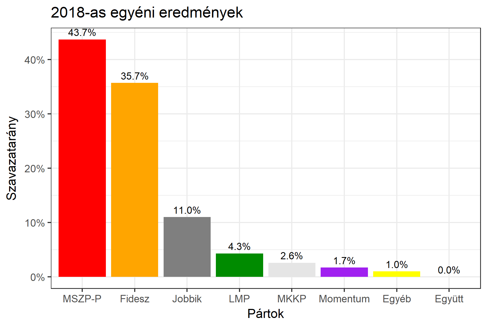

<h1 class="page-title">{{ page.title | escape }}</h1>

    

          

		  <h5>Csongrád megye 1-es választókerület (Szeged)</h5>
 <h5><strong>2018-as egyéni eredmények</strong></h5>  <table class="striped">
              <thead>
                <tr>
                    <th>Jelöltek</th>
                    <th>Szavazatarány (százalék)</th>
					<th>Eltérés a becsléstől</th>
                </tr>
              </thead>
              <tbody>
             <tr>
                  <td>Bartók Csaba - Fidesz-KDNP </td>
				   <td id="id_fidesz">35.7%</td>
				   <td>+3.9%</td>
			</tr>
			<tr><td>Tóth Péter - Jobbik </td> 
			<td id="id_jobbik">11.0%</td>
				   <td>-0.7%</td>
			</tr>
<tr>
                  <td>Szabó Sándor - MSZP-Párbeszéd </td>
				   <td id="id_baloldal">43.7%</td>
				   <td>+1.2%</td>
			</tr>
			<tr>
                  <td>Bodrog Zoltán - LMP </td>
				   <td id="id_lmp">4.3%</td>
				   <td>-4.2%</td>
			</tr>
			<tr>
				  <td>Mihálik Edvin - Momentum </td>
				   <td id="id_momentum">1.7%</td>
				   <td>-1.9%</td>
			</tr>
                
<tr>
<td>Pál Anna - MKKP </td>
 <td id="id_mkkp">2.6%</td>
				   <td>+0.6%</td>
</tr>
              </tbody>
            </table><h6><strong>Választókerületi profil (2014-ben): Enyhén Fideszes (baloldali kihívó)</strong></h6>
 

 
			

          

    

    

          

		  <h5>Csongrád megye 1-es választókerület (Szeged) - 2014-es eredmények</h5>
            <table class="striped">
              <thead>
                <tr>
                    <th>Jelöltek</th>
                    <th>Szavazatarányok</th>
                </tr>
              </thead>
              <tbody>
			  <tr>
				  <td>Szabó Sándor - Összefogás (MSZP-Együtt-DK-PM-MLP)</td>
				  <td>39.4%</td>
			</tr>
             <tr>
                  <td>Dr. Bohács Zsolt József - Fidesz-KDNP</td>
				  <td>34.0%</td>
			</tr>
			<tr>
			      <td>Rácz Tibor - Jobbik</td>
				  <td>14.6%</td>
			</tr>
			<tr>
				  <td>Tanács Eszter - LMP</td>
				  <td>7.8%</td>
			</tr>                
              </tbody>
            </table>
			<h5>Győztes: Összefogás, 5.4%-kal</h5>
          

    

