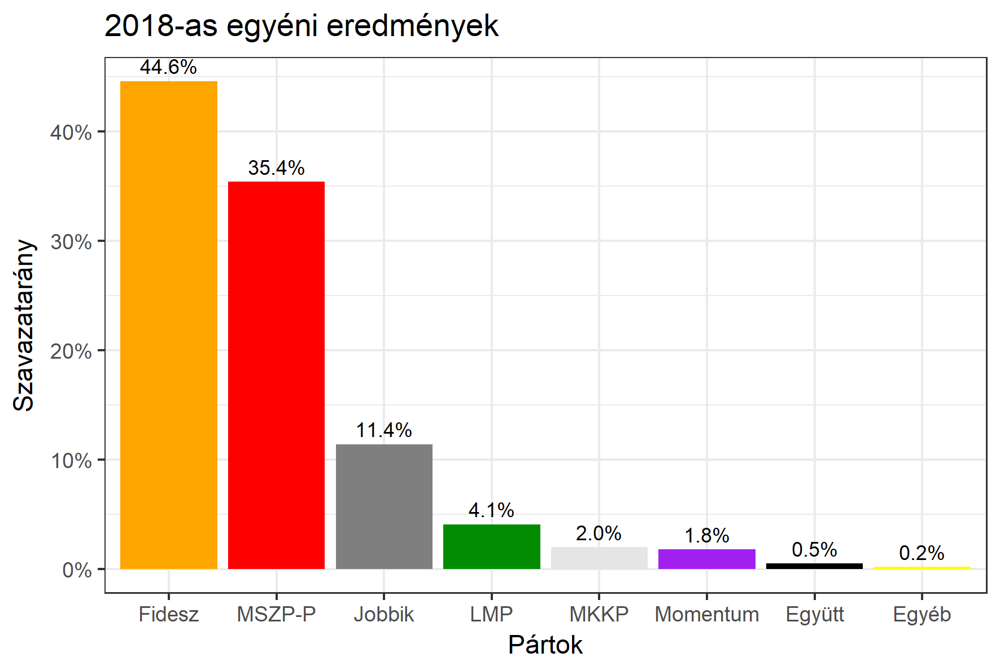

<h1 class="page-title">{{ page.title | escape }}</h1>

    

          

		  <h5>Csongrád megye 2-es választókerület (Szeged)</h5>
 <h5><strong>2018-as egyéni eredmények</strong></h5>  <table class="striped">
              <thead>
                <tr>
                    <th>Jelöltek</th>
                    <th>Szavazatarány (százalék)</th>
<th>Eltérés a becsléstől</th>
                </tr>
              </thead>
              <tbody>
             <tr>
                  <td>B. Nagy László - Fidesz-KDNP </td>
				   <td id="id_fidesz">44.6%</td>
				   <td>+3.0%</td>
			</tr>
			<tr><td>Fackelmann István - Jobbik </td> 
			<td id="id_jobbik">11.4%</td>
				   <td>-1.1%</td>
			</tr>
<tr>
                  <td>Joób Márton - MSZP-Párbeszéd </td>
				  <td id="id_baloldal">35.4%</td>
				   <td>+1.9%</td>
			</tr>
			<tr>
                  <td>dr. Tessényi Judit - LMP </td>
				   <td id="id_lmp">4.1%</td>
				   <td>-3.2%</td>
			</tr>
			<tr>
				  <td>Boros-Gyevi Gergely - Momentum </td>
				  <td id="id_momentum">1.8%</td>
				   <td>-0.8%</td>
			</tr>
<tr>
<td>Györgyey János - Együtt </td>
 <td id="id_egyutt">0.5%</td>
				   <td>-1.1%</td>
</tr> 
<tr>
<td>Pose Rozalinda - MKKP </td>
 <td id="id_mkkp">2.0%</td>
				   <td>+1.0%</td>
</tr>            
              </tbody>
            </table><h6><strong>Választókerületi profil (2014-ben): Stabil Fideszes</strong></h6>
 

 
			

          

    

    

          

		  <h5>Csongrád megye 2-es választókerület (Szeged) - 2014-es eredmények</h5>
            <table class="striped">
              <thead>
                <tr>
                    <th>Jelöltek</th>
                    <th>Szavazatarányok</th>
                </tr>
              </thead>
              <tbody>
			  <tr>
                  <td>B. Nagy László - Fidesz-KDNP</td>
				  <td>43.9%</td>
			</tr>
			  <tr>
				  <td>Némethné Bátyai Edina Beáta - Összefogás (MSZP-Együtt-DK-PM-MLP)</td>
				  <td>32.1%</td>
			</tr>
			<tr>
			      <td>Tóth Péter - Jobbik</td>
				  <td>15.4%</td>
			</tr>
			<tr>
				  <td>Tatár Gábor - LMP</td>
				  <td>6.6%</td>
			</tr>                
              </tbody>
            </table>
			<h5>Győztes: Fidesz-KDNP, 11.8%-kal</h5>
          

    

