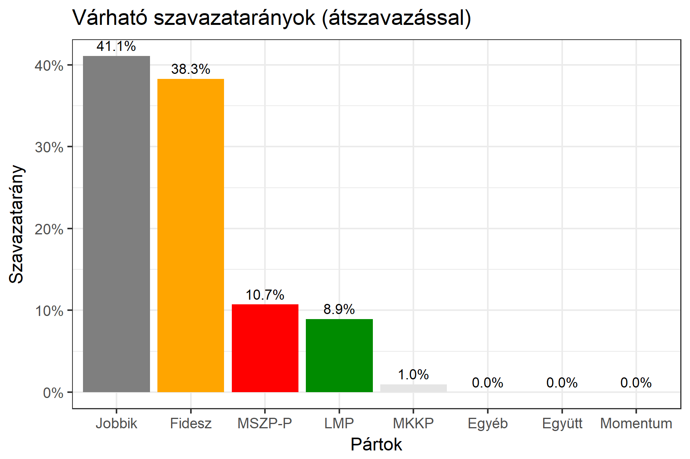

<h1 class="page-title">{{ page.title | escape }}</h1>

    

          

		  <h5>Csongrád megye 4-es választókerület (Hódmezővásárhely)</h5>
 <h5><strong>2018-as egyéni eredmények</strong></h5>  <table class="striped">
              <thead>
                <tr>
                    <th>Jelöltek</th>
                    <th>Szavazatarány (százalék)</th>
<th>Eltérés a becsléstől</th>
                </tr>
              </thead>
              <tbody>
             <tr>
                  <td>Lázár János - Fidesz-KDNP </td>
				   <td id="id_fidesz">51.8%</td>
				   <td>+13.5%</td>
			</tr>
			<tr><td>Dr. Kiss Attila - Jobbik </td> 
			<td id="id_jobbik">36.7%</td>
				   <td>-4.4%</td>
			</tr>
<tr>
                  <td>Rója István - MSZP-Párbeszéd </td>
				  <td id="id_baloldal">7.4%</td>
				   <td>-3.3%</td>
			</tr>
			<tr>
                  <td>Pongrácz Gergely - LMP </td>
				   <td id="id_lmp">1.8%</td>
				   <td>-7.1%</td>
			</tr>
<tr>
<td>Farkas Tamás - MKKP </td>
 <td id="id_mkkp">1.3%</td>
				   <td>+0.3%</td>
</tr>                 
              </tbody>
            </table><h6><strong>Választókerületi profil (2014-ben): Kétesélyes (Fidesz és Jobbik között)</strong></h6>
 
<h5><strong>2018. április 8-i becslések (átszavazással):</strong></h5>  
			<h6><strong>Becslés megbízhatósága a legesélyesebb jelöltről:</strong> <strong>A Jobbikos jelölt az egyértelmű esélyes</strong></h6> 
<h5><strong>Legesélyesebb ellenzéki jelölt: Dr. Kiss Attila (Jobbik)</strong></h5>
<h5><strong><a href="https://rendszervaltas2018.hu">Márki-Zay Péter ajánlása</a>: Dr. Kiss Attila (Jobbik) </strong></h5>
<h5><strong><a href="https://www.v18.eu/53korzet">A V18 ajánlása</a>: Dr. Kiss Attila (Jobbik)</strong></h5>

  <table class="striped">
              <thead>
                <tr>
                    <th>Jelöltek</th>
                    <th>Várható szavazatarány egyéniben (zárójelben az arányok átszavazás esetén)</th>
                </tr>
              </thead>
              <tbody>
             <tr>
                  <td>Lázár János - Fidesz-KDNP </td>
				   <td id="id_fidesz">37.9% &emsp; (38.3%)</td>
			</tr>
			<tr><td>Dr. Kiss Attila - Jobbik </td> <td id="id_jobbik">32.0% &emsp; (41.1%)</td></tr>
<tr>
                  <td>Rója István - MSZP-Párbeszéd </td>
				   <td id="id_baloldal">12.8% &emsp; (10.7%)</td>
			</tr>
			<tr>
                  <td>Pongrácz Gergely - LMP </td>
				   <td id="id_lmp">10.2% &emsp; (8.9%)</td>
			</tr>
<tr>
<td>Farkas Tamás - MKKP </td>
 <td id="id_mkkp">1.2% &emsp; (1.0%)</td>
</tr>                 
              </tbody>
            </table><h5>Várható győztes: Dr. Kiss Attila (Jobbik)</h5>
			
			
 
<strong>Fontos:</strong> A becslések csak az egyéni jelöltre adott szavazatok arányát mutatják, nem a listás szavazatokét. A becslés jelentős eltérést mutathat a kisebb pártok esetében és olyan kerületekben, ahol nincs egyértelmű esélyes jelölt.

 
			

          

    

    

          

		  <h5>Csongrád megye 4-es választókerület (Hódmezővásárhely) - 2014-es eredmények</h5>
            <table class="striped">
              <thead>
                <tr>
                    <th>Jelöltek</th>
                    <th>Szavazatarányok</th>
                </tr>
              </thead>
              <tbody>
			  <tr>
                  <td>Dr. Lázár János - Fidesz-KDNP</td>
				  <td>43.6%</td>
			</tr>
			<tr>
			      <td>Dr. Kiss Attila - Jobbik</td>
				  <td>24.8%</td>
			</tr>
			  <tr>
				  <td>Varga Péter - Összefogás (MSZP-Együtt-DK-PM-MLP)</td>
				  <td>19.5%</td>
			</tr>
			<tr>
				  <td>Nagy-Bandó András - LMP</td>
				  <td>6.9%</td>
			</tr>                
              </tbody>
            </table>
			<h5>Győztes: Fidesz-KDNP, 18.8%-kal</h5>
          

    

