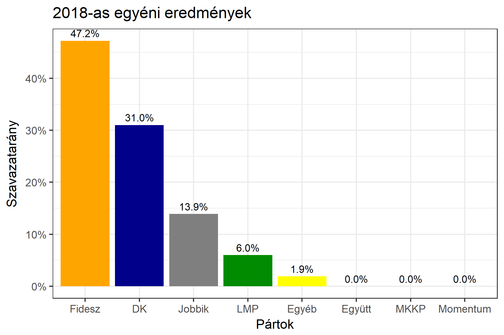

<h1 class="page-title">{{ page.title | escape }}</h1>

    

          

		  <h5>Fejér megye 1-es választókerület (Székesfehérvár)</h5>
 <h5><strong>2018-as egyéni eredmények</strong></h5>  <table class="striped">
              <thead>
                <tr>
                    <th>Jelöltek</th>
                    <th>Szavazatarány (százalék)</th>
<th>Eltérés a becsléstől</th>
                </tr>
              </thead>
              <tbody>
             <tr>
                  <td>Vargha Tamás - Fidesz-KDNP </td>
				   <td id="id_fidesz">47.2%</td>
				   <td>+3.7%</td>
			</tr>
			<tr><td>Tóth Nóra Tímea - Jobbik </td> 
			<td id="id_jobbik">13.9%</td>
				   <td>-4.1%</td>
			</tr>
<tr>
                  <td>Ráczné Földi Judit - DK </td>
				   <td id="id_baloldal">31.0%</td>
				   <td>-0.4%</td>
			</tr>
			<tr>
                  <td>Rákosi Judit - LMP </td>
				  <td id="id_lmp">6.0%</td>
				   <td>-1.1%</td>
			</tr>
              </tbody>
            </table><h6><strong>Választókerületi profil (2014-ben): Stabil Fideszes</strong></h6>
 

 
			

          

    

    

          

		  <h5>Fejér megye 1-es választókerület (Székesfehérvár) - 2014-es eredmények</h5>
            <table class="striped">
              <thead>
                <tr>
                    <th>Jelöltek</th>
                    <th>Szavazatarányok</th>
                </tr>
              </thead>
              <tbody>
			  <tr>
                  <td>Vargha Tamás János - Fidesz-KDNP</td>
				  <td>44.2%</td>
			</tr>
			  <tr>
				  <td>Dr. Márton Roland - Összefogás (MSZP-Együtt-DK-PM-MLP)</td>
				  <td>30.3%</td>
			</tr>
			<tr>
			      <td>Dr. Mező Balázs Béla - Jobbik</td>
				  <td>16.8%</td>
			</tr>
			<tr>
				  <td>Bialkó László Gergő - LMP</td>
				  <td>6.2%</td>
			</tr>                
              </tbody>
            </table>
			<h5>Győztes: Fidesz-KDNP, 13.9%-kal</h5>
          

    

