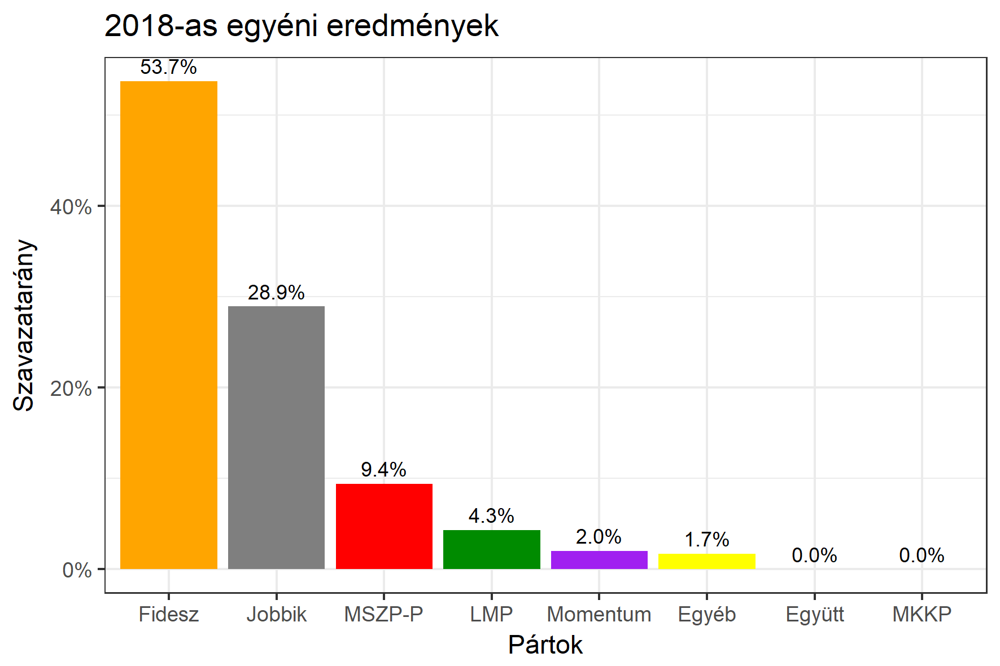

<h1 class="page-title">{{ page.title | escape }}</h1>

    

          

		  <h5>Fejér megye 2-es választókerület (Székesfehérvár)</h5>
 <h5><strong>2018-as egyéni eredmények</strong></h5>  <table class="striped">
              <thead>
                <tr>
                    <th>Jelöltek</th>
                    <th>Szavazatarány (százalék)</th>
<th>Eltérés a becsléstől</th>
                </tr>
              </thead>
              <tbody>
             <tr>
                  <td>Törő Gábor - Fidesz-KDNP </td>
				   <td id="id_fidesz">53.7%</td>
				   <td>+5.5%</td>
			</tr>
			<tr><td>Fazakas Attila - Jobbik </td> 
			<td id="id_jobbik">28.9%</td>
				   <td>-1.5%</td>
			</tr>
<tr>
                  <td>Horváth András - MSZP-Párbeszéd </td>
				  <td id="id_baloldal">9.4%</td>
				   <td>-3.5%</td>
				   </td>
			</tr>
			<tr>
                  <td>Perneczky László - LMP </td>
				  <td id="id_lmp">4.3%</td>
				   <td>-2.0%</td>
			</tr>
			<tr>
				  <td>Tóth Péter - Momentum </td>
				  <td id="id_momentum">2.0%</td>
				   <td>-0.2%</td>
			</tr>
                
              </tbody>
            </table><h6><strong>Választókerületi profil (2014-ben): Biztos Fideszes</strong></h6>
 

 
			

          

    

    

          

		  <h5>Fejér megye 2-es választókerület (Székesfehérvár) - 2014-es eredmények</h5>
            <table class="striped">
              <thead>
                <tr>
                    <th>Jelöltek</th>
                    <th>Szavazatarányok</th>
                </tr>
              </thead>
              <tbody>
			  <tr>
                  <td>Törő Gábor - Fidesz-KDNP</td>
				  <td>50.2%</td>
			</tr>
			<tr>
			      <td>Fazakas Attila Levente - Jobbik</td>
				  <td>21.9%</td>
			</tr>
			  <tr>
				  <td>Herczog Edit - Összefogás (MSZP-Együtt-DK-PM-MLP)</td>
				  <td>19.0%</td>
			</tr>
			<tr>
				  <td>Kalmár András - LMP</td>
				  <td>4.4%</td>
			</tr>                
              </tbody>
            </table>
			<h5>Győztes: Fidesz-KDNP, 28.3%-kal</h5>
          

    

