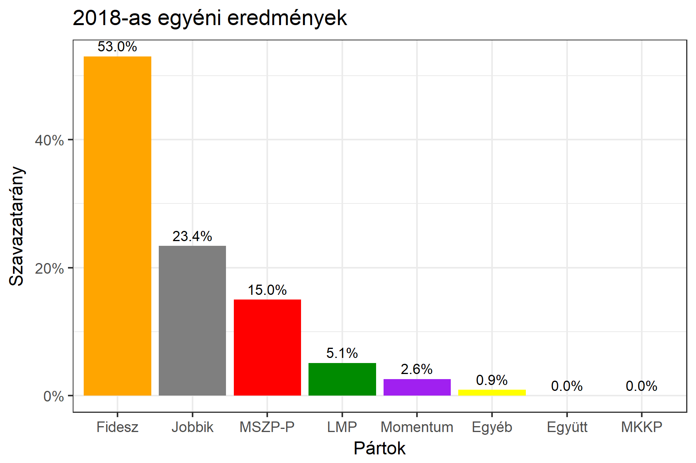

<h1 class="page-title">{{ page.title | escape }}</h1>

    

          

		  <h5>Fejér megye 3-as választókerület (Bicske)</h5>
 <h5><strong>2018-as egyéni eredmények</strong></h5>  <table class="striped">
              <thead>
                <tr>
                    <th>Jelöltek</th>
                    <th>Szavazatarány (százalék)</th>
<th>Eltérés a becsléstől</th>
                </tr>
              </thead>
              <tbody>
             <tr>
                  <td>Tessely Zoltán - Fidesz-KDNP </td>
				   <td id="id_fidesz">53.0%</td>
				   <td>+3.9%</td>
			</tr>
			<tr><td>Varga László Béla - Jobbik </td> 
			<td id="id_jobbik">23.4%</td>
				   <td>+0.1%</td>
			</tr>
<tr>
                  <td>Szilágyi László - MSZP-Párbeszéd </td>
				   <td id="id_baloldal">15.0%</td>
				   <td>-0.7%</td>
			</tr>
			<tr>
                  <td>Szatmári Ildikó - LMP </td>
				   <td id="id_lmp">5.1%</td>
				   <td>-3.7%</td>
			</tr>
			<tr>
				  <td>Molnár Dániel - Momentum </td>
				   <td id="id_momentum">2.6%</td>
				   <td>-0.5%</td>
			</tr>
                
              </tbody>
            </table><h6><strong>Választókerületi profil (2014-ben): Biztos Fideszes</strong></h6>
 

 
			

          

    

    

          

		  <h5>Fejér megye 3-as választókerület (Bicske) - 2014-es eredmények</h5>
            <table class="striped">
              <thead>
                <tr>
                    <th>Jelöltek</th>
                    <th>Szavazatarányok</th>
                </tr>
              </thead>
              <tbody>
			  <tr>
                  <td>Tessely Zoltán Károly - Fidesz-KDNP</td>
				  <td>50.4%</td>
			</tr>
			<tr>
				  <td>Horváth András Tibor - Összefogás (MSZP-Együtt-DK-PM-MLP)</td>
				  <td>21.3%</td>
			</tr>
			<tr>
			      <td>Gáspár Kornél Dániel - Jobbik</td>
				  <td>17.9%</td>
			</tr>
			<tr>
				  <td>Varga György - LMP</td>
				  <td>6.0%</td>
			</tr>                
              </tbody>
            </table>
			<h5>Győztes: Fidesz-KDNP, 29.1%-kal</h5>
          

    

