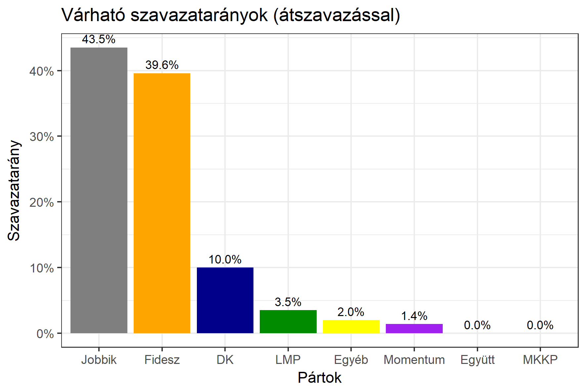

<h1 class="page-title">{{ page.title | escape }}</h1>

    

          

		  <h5>Fejér megye 4-es választókerület (Dunaújváros)</h5>
		   
		  <iframe src="https://app.tisztaszavazas.hu/egyedi-lekerdezesek/22-becsles-18-eredmenyei-alapjan?embedded=true&vk_id=5eee96968ecde10023631b90&hide_table=true" width="100%" height="600" style="border: 0;"></iframe>
		   
 <h5><strong>2018-as egyéni eredmények</strong></h5>  <table class="striped">
              <thead>
                <tr>
                    <th>Jelöltek</th>
                    <th>Szavazatarány (százalék)</th>
					<th>Eltérés a becsléstől</th>
                </tr>
              </thead>
              <tbody>
             <tr>
                  <td>dr. Galambos Dénes - Fidesz-KDNP </td>
				   <td id="id_fidesz">39.6%</td>
				   <td>+3.5%</td>
			</tr>
			<tr><td>Pintér Tamás - Jobbik </td> 
			<td id="id_jobbik">43.5%</td>
				   <td>+10.3%</td>
			</tr>
<tr>
                  <td>Mezei Zsolt - DK </td>
				   <td id="id_baloldal">10.0%</td>
				   <td>-13.9%</td>
			</tr>
			<tr>
                  <td>Illésy István - LMP </td>
				   <td id="id_lmp">3.5%</td>
				   <td>-1.5%</td>
			</tr>
			<tr>
				  <td>Kaszó Róbert - Momentum </td>
				   <td id="id_momentum">1.4%</td>
				   <td>-0.4%</td>
			</tr>
                
              </tbody>
            </table><h6><strong>Választókerületi profil (2014-ben): Enyhén Fideszes (baloldal / Jobbik az esélyes kihívók)</strong></h6>
 

 
			

          

    

    

          

		  <h5>Fejér megye 4-es választókerület (Dunaújváros) - 2014-es eredmények</h5>
            <table class="striped">
              <thead>
                <tr>
                    <th>Jelöltek</th>
                    <th>Szavazatarányok</th>
                </tr>
              </thead>
              <tbody>
			  <tr>
                  <td>Dr. Galambos Dénes - Fidesz-KDNP</td>
				  <td>35.9%</td>
			</tr>
			<tr>
				  <td>Magyar András Tamás - Összefogás (MSZP-Együtt-DK-PM-MLP)</td>
				  <td>29.4%</td>
			</tr>
			<tr>
			      <td>Pintér Tamás - Jobbik</td>
				  <td>25.2%</td>
			</tr>
			<tr>
				  <td>Illéssy István - LMP</td>
				  <td>4.4%</td>
			</tr>                
              </tbody>
            </table>
			<h5>Győztes: Fidesz-KDNP, 6.5%-kal</h5>
          

    

