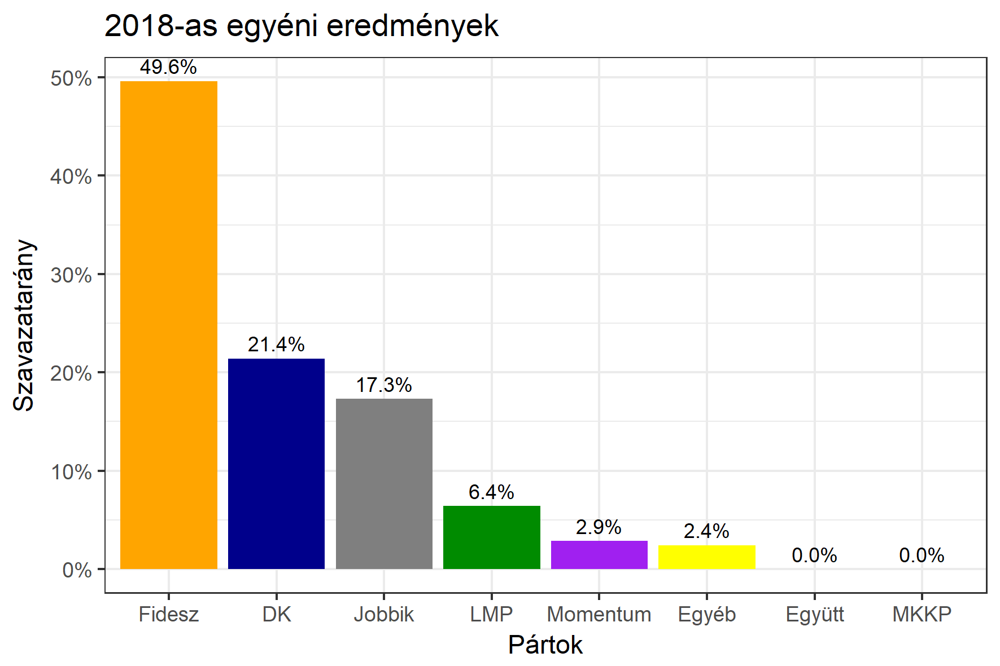

<h1 class="page-title">{{ page.title | escape }}</h1>

    

          

		  <h5>Győr-Moson-Sopron megye 1-es választókerület (Győr)</h5>
 <h5><strong>2018-as egyéni eredmények</strong></h5>  <table class="striped">
              <thead>
                <tr>
                    <th>Jelöltek</th>
                    <th>Szavazatarány (százalék)</th>
<th>Eltérés a becsléstől</th>
                </tr>
              </thead>
              <tbody>
             <tr>
                  <td>Simon Róbert Balázs - Fidesz-KDNP </td>
				   <td id="id_fidesz">49.6%</td>
				   <td>+2.6%</td>
			</tr>
			<tr><td>Fodor Roland - Jobbik </td> 
			<td id="id_jobbik">17.3%</td>
				   <td>+2.5%</td>
			</tr>
<tr>
                  <td>Glázer Tímea - DK </td>
				   <td id="id_baloldal">21.6%</td>
				   <td>-7.4%</td>
			</tr>
			<tr>
                  <td>Jenei Ferenc - LMP </td>
				   <td id="id_lmp">6.4%</td>
				   <td>+0.1%</td>
			</tr>
			<tr>
				  <td>Molnár József - Momentum </td>
				   <td id="id_momentum">2.9%</td>
				   <td>+0.0%</td>
			</tr>          
    
              </tbody>
            </table><h6><strong>Választókerületi profil (2014-ben): Biztos Fideszes</strong></h6>
 

 
			

          

    

    

          

		  <h5>Győr-Moson-Sopron megye 1-es választókerület (Győr) - 2014-es eredmények</h5>
            <table class="striped">
              <thead>
                <tr>
                    <th>Jelöltek</th>
                    <th>Szavazatarányok</th>
                </tr>
              </thead>
              <tbody>
             <tr>
                  <td>Simon Róbert Balázs - Fidesz-KDNP</td>
				  <td>48.8%</td>
			</tr>
			<tr>
			      <td>Fábián György Zoltán - Összefogás (MSZP-Együtt-DK-PM-MLP)</td>
				  <td>29.2%</td>
			      
			</tr>
			<tr>
			      <td>Fodor Roland Alexander - Jobbik</td>
				  <td>14.4%</td>
			</tr>
			<tr>
				  <td>Madarász Zsuzsanna - LMP</td>
				  <td>5.6%</td>
			</tr>                
              </tbody>
            </table>
			<h5>Győztes: Fidesz-KDNP, 19.6%-kal</h5>
          

    

