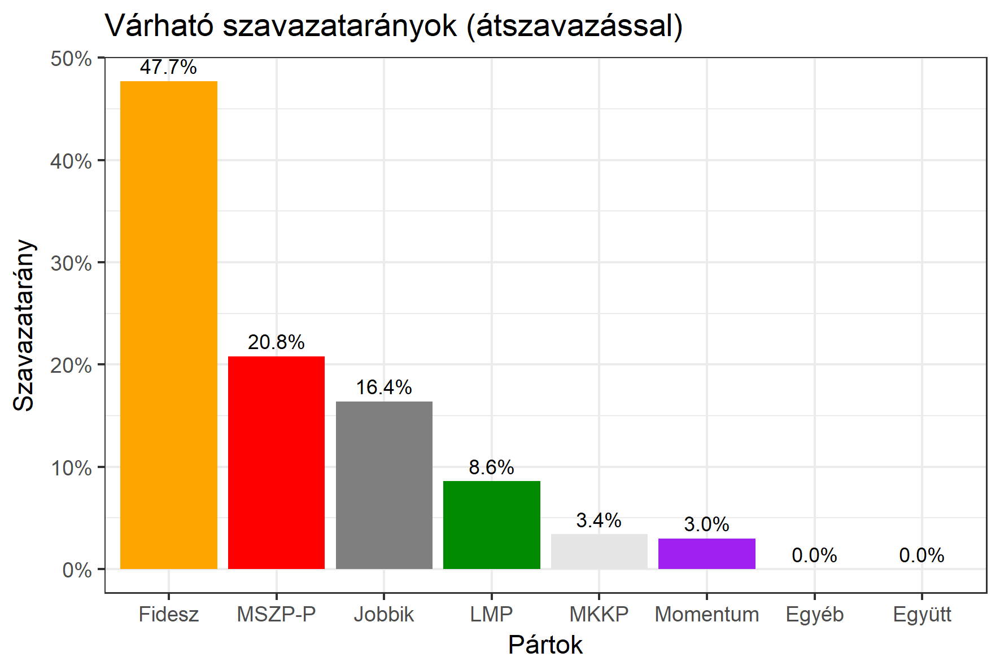

<h1 class="page-title">{{ page.title | escape }}</h1>

    

          
<h6><strong>A következő becslés várható időpontja: 2018. március 19.</strong></h6>
		  <h5>Győr-Moson-Sopron megye 4-es választókerület (Sopron)</h5>
 <h6><strong>Választókerületi profil (2014-ben): Biztos Fideszes</strong></h6>
 
<h6><strong>Legfrissebb 2018-as becslések eredménye:</strong></h6> 
			<h5><strong>Legesélyesebb ellenzéki jelölt: MSZP-Párbeszéd/DK</strong></h5>
<table class="striped">
              <thead>
                <tr>
                    <th>Jelöltek</th>
                    <th>Várható szavazatarány egyéniben (átszavazással)</th>
                </tr>
              </thead>
              <tbody>
             <tr>
                  <td>Barcza Attila - Fidesz-KDNP </td>
				  <td id="id_fidesz">49.3%</td>
			</tr>
			<tr><td>Dr. Brenner Koloman - Jobbik </td><td id="id_jobbik">16.7%</td></tr>
<tr>
                  <td>Póczik Roland - MSZP-Párbeszéd </td>
				  <td id="id_baloldal">20.4%</td>
			</tr>
			<tr>
                  <td>Szakács Gyula - LMP </td>
				  <td id="lmp">8.7%</td>
			</tr> 
			<tr>
				  <td>Supka-Kovácsné Holzhofer Tünde - Momentum </td>
				  <td id="id_momentum">3.1%</td>
			</tr>
      
<tr>
<td>Tichy-Rács József - MKKP </td>
<td id="id_mkkp">1.8%</td>
</tr>          
              </tbody>
            </table><h5>Várható győztes: Fidesz</h5>
			
			
  
<strong>Fontos:</strong> A becslések csak az egyéni jelöltre adott szavazatok arányát mutatják, nem a listás szavazatokét. A becslés jelentős eltérést mutathat a kisebb pártok esetében és olyan kerületekben, ahol nincs egyértelmű esélyes jelölt.

 
			
 <h6><strong>Becslés megbízhatósága a legesélyesebb jelöltről:</strong> <strong>Nem egyértelmű az esélyes - az esélyes jelölt még változhat</strong></h6>

Megjegyzés a kerülethez: A Fidesz biztosan vezet, az ellenzéknek magas részvétel és mozgósítás esetén van esélye a kerületben.

Az aktuális becslés leírásáról <a href="../metodologia#0312">bővebben itt olvashatsz</a>.

          

    

    

          

		  <h5>Győr-Moson-Sopron megye 4-es választókerület (Sopron) - 2014-es eredmények</h5>
            <table class="striped">
              <thead>
                <tr>
                    <th>Jelöltek</th>
                    <th>Szavazatarányok</th>
                </tr>
              </thead>
              <tbody>
             <tr>
                  <td>Firtl Mátyás Sándor - Fidesz-KDNP</td>
				  <td>50.6%</td>
			</tr>
			<tr>
			      <td>Kalmár István - Összefogás (MSZP-Együtt-DK-PM-MLP)</td>
				  <td>23.8%</td> 
			</tr>
			<tr>
			      <td>Gőbl Gábor - Jobbik</td>
				  <td>16.8%</td>
			</tr>
			<tr>
				  <td>Bebesi József Lajos - LMP</td>
				  <td>6.3%</td>
			</tr>                
              </tbody>
            </table>
			<h5>Győztes: Fidesz-KDNP, 26.8%-kal</h5>
          

    

