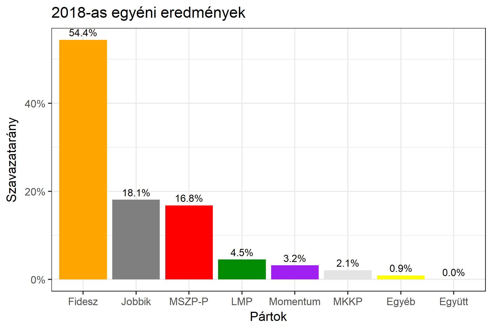
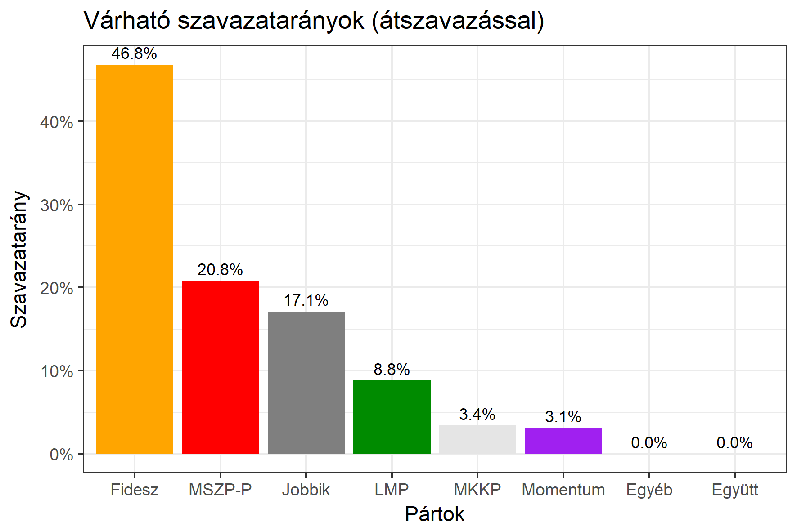

<h1 class="page-title">{{ page.title | escape }}</h1>

    

          

		  <h5>Győr-Moson-Sopron megye 4-es választókerület (Sopron)</h5>
 <h5><strong>2018-as egyéni eredmények</strong></h5>  <table class="striped">
              <thead>
                <tr>
                    <th>Jelöltek</th>
                    <th>Szavazatarány (százalék)</th>
<th>Eltérés a becsléstől</th>
                </tr>
              </thead>
              <tbody>
             <tr>
                  <td>Barcza Attila - Fidesz-KDNP </td>
				   <td id="id_fidesz">54.4%</td>
				   <td>+7.6%</td>
			</tr>
			<tr><td>Dr. Brenner Koloman - Jobbik </td> 
			<td id="id_jobbik">18.1%</td>
				   <td>+1.0%</td>
			</tr>
<tr>
                  <td>Póczik Roland - MSZP-Párbeszéd </td>
				   <td id="id_baloldal">16.8%</td>
				   <td>-4.0%</td>
			</tr>
			<tr>
                  <td>Szakács Gyula - LMP </td>
				   <td id="id_lmp">4.5%</td>
				   <td>-4.3%</td>
			</tr> 
			<tr>
				  <td>Supka-Kovácsné Holzhofer Tünde - Momentum </td>
				   <td id="id_momentum">3.2%</td>
				   <td>+0.1%</td>
			</tr>
      
<tr>
<td>Tichy-Rács József - MKKP </td>
 <td id="id_mkkp">2.1%</td>
				   <td>-1.3%</td>
</tr>          
              </tbody>
            </table><h6><strong>Választókerületi profil (2014-ben): Biztos Fideszes</strong></h6>
 
<h5><strong>2018. április 8-i becslések (átszavazással):</strong></h5>  
			<h6><strong>Becslés megbízhatósága a legesélyesebb jelöltről:</strong> <strong>Nincs egyértelmű esélyes</strong></h6> 
<h5><strong>Legesélyesebb ellenzéki jelölt: Póczik Roland (MSZP-Párbeszéd)</strong></h5>
<h5><strong><a href="https://rendszervaltas2018.hu">Márki-Zay Péter ajánlása</a>: Póczik Roland (MSZP-Párbeszéd)</strong></h5>

  <table class="striped">
              <thead>
                <tr>
                    <th>Jelöltek</th>
                    <th>Várható szavazatarány egyéniben (zárójelben az arányok átszavazás esetén)</th>
                </tr>
              </thead>
              <tbody>
             <tr>
                  <td>Barcza Attila - Fidesz-KDNP </td>
				   <td id="id_fidesz">45.6% &emsp; (46.8%)</td>
			</tr>
			<tr><td>Dr. Brenner Koloman - Jobbik </td> <td id="id_jobbik">16.8% &emsp; (17.1%)</td></tr>
<tr>
                  <td>Póczik Roland - MSZP-Párbeszéd </td>
				   <td id="id_baloldal">17.2% &emsp; (20.8%)</td>
			</tr>
			<tr>
                  <td>Szakács Gyula - LMP </td>
				   <td id="id_lmp">10.3% &emsp; (8.8%)</td>
			</tr> 
			<tr>
				  <td>Supka-Kovácsné Holzhofer Tünde - Momentum </td>
				   <td id="id_momentum">3.6% &emsp; (3.1%)</td>
			</tr>
      
<tr>
<td>Tichy-Rács József - MKKP </td>
 <td id="id_mkkp">4.1% &emsp; (3.4%)</td>
</tr>          
              </tbody>
            </table><h5>Várható győztes: Fidesz-KDNP</h5>
			
			
 
<strong>Fontos:</strong> A becslések csak az egyéni jelöltre adott szavazatok arányát mutatják, nem a listás szavazatokét. A becslés jelentős eltérést mutathat a kisebb pártok esetében és olyan kerületekben, ahol nincs egyértelmű esélyes jelölt.

 
			

Az aktuális becslés leírásáról <a href="../metodologia#0406">bővebben itt olvashatsz</a>.

          

    

    

          

		  <h5>Győr-Moson-Sopron megye 4-es választókerület (Sopron) - 2014-es eredmények</h5>
            <table class="striped">
              <thead>
                <tr>
                    <th>Jelöltek</th>
                    <th>Szavazatarányok</th>
                </tr>
              </thead>
              <tbody>
             <tr>
                  <td>Firtl Mátyás Sándor - Fidesz-KDNP</td>
				  <td>50.6%</td>
			</tr>
			<tr>
			      <td>Kalmár István - Összefogás (MSZP-Együtt-DK-PM-MLP)</td>
				  <td>23.8%</td> 
			</tr>
			<tr>
			      <td>Gőbl Gábor - Jobbik</td>
				  <td>16.8%</td>
			</tr>
			<tr>
				  <td>Bebesi József Lajos - LMP</td>
				  <td>6.3%</td>
			</tr>                
              </tbody>
            </table>
			<h5>Győztes: Fidesz-KDNP, 26.8%-kal</h5>
          

    

