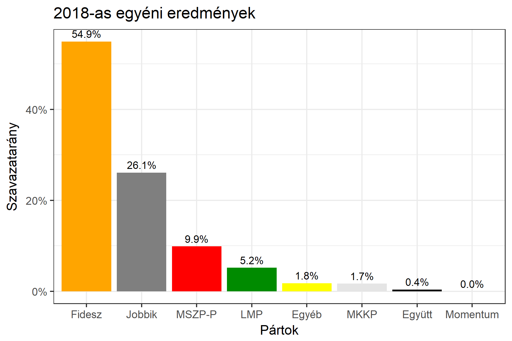

<h1 class="page-title">{{ page.title | escape }}</h1>

    

          

		  <h5>Győr-Moson-Sopron megye 5-ös választókerület (Mosonmagyaróvár)</h5>
 <h5><strong>2018-as egyéni eredmények</strong></h5>  <table class="striped">
              <thead>
                <tr>
                    <th>Jelöltek</th>
                    <th>Szavazatarány (százalék)</th>
<th>Eltérés a becsléstől</th>
                </tr>
              </thead>
              <tbody>
             <tr>
                  <td>Dr. Nagy István - Fidesz-KDNP </td>
				   <td id="id_fidesz">54.9%</td>
				   <td>+5.1%</td>
			</tr>
			<tr><td>Jávor Miklós - Jobbik </td> 
			<td id="id_jobbik">26.1%</td>
				   <td>+1.5%</td>
			</tr>
<tr>
                  <td>Bogyai Zsolt - MSZP-Párbeszéd </td>
				  <td id="id_baloldal">9.9%</td>
				   <td>-6.4%</td>
			</tr>
			<tr>
                  <td>Goda Bálint Zsolt - LMP </td>
				   <td id="id_lmp">5.2%</td>
				   <td>-1.9%</td>
			</tr>

<tr>
<td>Deschelák Károly Ferenc -  Együtt </td>
 <td id="id_egyutt">0.4%</td>
				   <td>-1.0%</td>
</tr>                
<tr>
<td>Nagy Péter Krisztián - MKKP </td>
 <td id="id_mkkp">1.7%</td>
				   <td>+0.9%</td>
</tr> 
              </tbody>
            </table><h6><strong>Választókerületi profil (2014-ben): Biztos Fideszes</strong></h6>
 

 
			

          

    

    

          

		  <h5>Győr-Moson-Sopron megye 5-ös választókerület (Mosonmagyaróvár) - 2014-es eredmények</h5>
            <table class="striped">
              <thead>
                <tr>
                    <th>Jelöltek</th>
                    <th>Szavazatarányok</th>
                </tr>
              </thead>
              <tbody>
             <tr>
                  <td>Dr. Nagy István - Fidesz-KDNP</td>
				  <td>50.4%</td>
			</tr>
			<tr>
			      <td>Lehóczki Attila - Összefogás (MSZP-Együtt-DK-PM-MLP)</td>
				  <td>22.0%</td> 
			</tr>
			<tr>
			      <td>Lipovits Máté - Jobbik</td>
				  <td>18.8%</td>
			</tr>
			<tr>
				  <td>Goda Bálint Zsolt - LMP</td>
				  <td>4.9%</td>
			</tr>                
              </tbody>
            </table>
			<h5>Győztes: Fidesz-KDNP, 28.4%-kal</h5>
          

    

