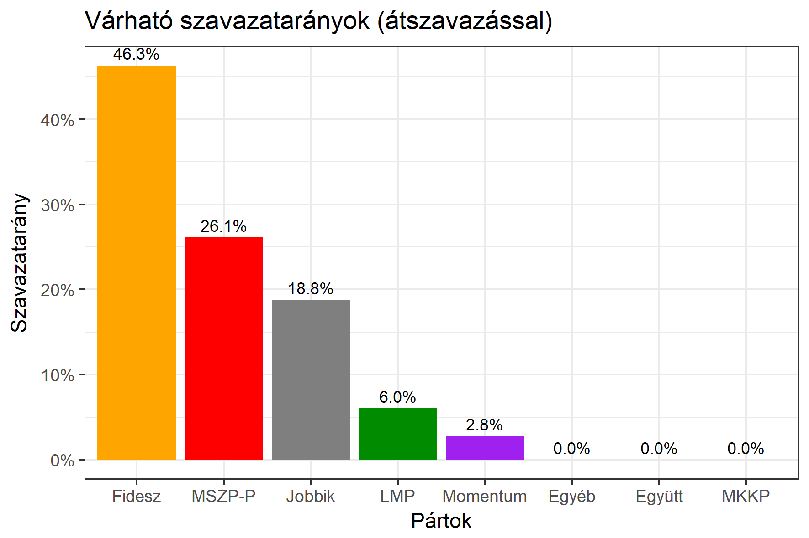

<h1 class="page-title">{{ page.title | escape }}</h1>

    

          

		  <h5>Hajdú-Bihar megye 1-es választókerület (Debrecen)</h5>
 <h5><strong>2018-as eredmények</strong></h5>  <table class="striped">
              <thead>
                <tr>
                    <th>Jelöltek</th>
                    <th>Szavazatarány (százalék)</th>
<th>Eltérés a becsléstől</th>
                </tr>
              </thead>
              <tbody>
             <tr>
                  <td>Kósa Lajos - Fidesz-KDNP </td>
				   <td id="id_fidesz">47.4%</td>
				   <td>+1.1%</td>
			</tr>
			<tr><td>Herpergel Róbert - Jobbik </td> 
			<td id="id_jobbik">15.2%</td>
				   <td>-3.6%</td>
			</tr>
<tr>
                  <td>Gulyásné dr. Gurmai Zita - MSZP-Párbeszéd </td>
				   <td id="id_baloldal">27.6%</td>
				   <td>+1.5%</td>
			</tr>
			<tr>
                  <td>Murguly Mátyás - LMP </td>
				   <td id="id_lmp">5.3%</td>
				   <td>-0.7%</td>
			</tr>
			<tr>
				  <td>Horváth Zoltán - Momentum </td>
				   <td id="id_momentum">3.0%</td>
				   <td>+0.2%</td>
			</tr>             
              </tbody>
            </table><h6><strong>Választókerületi profil (2014-ben): Biztos Fideszes</strong></h6>
 
<h6><strong>Legfrissebb 2018-as becslések eredménye (átszavazással):</strong></h6>  
			<h6><strong>Becslés megbízhatósága a legesélyesebb jelöltről:</strong> <strong>Nincs egyértelmű esélyes</strong></h6> 
<h5><strong>Legesélyesebb ellenzéki jelölt: Gulyásné dr. Gurmai Zita (MSZP-Párbeszéd)</strong></h5>
<h5><strong><a href="https://rendszervaltas2018.hu">Márki-Zay Péter ajánlása</a>: Gulyásné dr. Gurmai Zita (MSZP-Párbeszéd) </strong></h5>
<h5><strong><a href="https://www.v18.eu/53korzet">A V18 ajánlása</a>: Gulyásné dr. Gurmai Zita (MSZP-Párbeszéd)</strong></h5>

  <table class="striped">
              <thead>
                <tr>
                    <th>Jelöltek</th>
                    <th>Várható szavazatarány egyéniben (zárójelben az arányok átszavazás esetén)</th>
                </tr>
              </thead>
              <tbody>
             <tr>
                  <td>Kósa Lajos - Fidesz-KDNP </td>
				   <td id="id_fidesz">45.3% &emsp; (46.3%)</td>
			</tr>
			<tr><td>Herpergel Róbert - Jobbik </td> <td id="id_jobbik">18.6% &emsp; (18.8%)</td></tr>
<tr>
                  <td>Gulyásné dr. Gurmai Zita - MSZP-Párbeszéd </td>
				   <td id="id_baloldal">19.7% &emsp; (26.1%)</td>
			</tr>
			<tr>
                  <td>Murguly Mátyás - LMP </td>
				   <td id="id_lmp">9.1% &emsp; (6.0%)</td>
			</tr>
			<tr>
				  <td>Horváth Zoltán - Momentum </td>
				   <td id="id_momentum">4.2% &emsp; (2.8%)</td>
			</tr>             
              </tbody>
            </table><h5>Várható győztes: Fidesz-KDNP</h5>
			
			
 
<strong>Fontos:</strong> A becslések csak az egyéni jelöltre adott szavazatok arányát mutatják, nem a listás szavazatokét. A becslés jelentős eltérést mutathat a kisebb pártok esetében és olyan kerületekben, ahol nincs egyértelmű esélyes jelölt.

 
			

Az aktuális becslés leírásáról <a href="../metodologia#0406">bővebben itt olvashatsz</a>.

          

    

    

          

		  <h5>Hajdú-Bihar megye 1-es választókerület (Debrecen) - 2014-es eredmények</h5>
            <table class="striped">
              <thead>
                <tr>
                    <th>Jelöltek</th>
                    <th>Szavazatarányok</th>
                </tr>
              </thead>
              <tbody>
             <tr>
                  <td>Kósa Lajos - Fidesz-KDNP</td>
				  <td>47.1%</td>
			</tr>
			<tr>
			      <td>Dr. Szegedi István - Összefogás (MSZP-Együtt-DK-PM-MLP)</td>
				  <td>26.9%</td>
			      
			</tr>
			<tr>
			      <td>Herpergel Róbert - Jobbik</td>
				  <td>17.5%</td>
			</tr>
			<tr>
				  <td>Horváth András - LMP</td>
				  <td>5.4%</td>
			</tr>                
              </tbody>
            </table>
			<h5>Győztes: Fidesz-KDNP, 20.2%-kal</h5>
          

    

