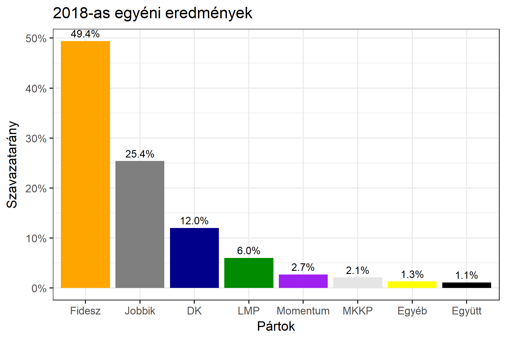
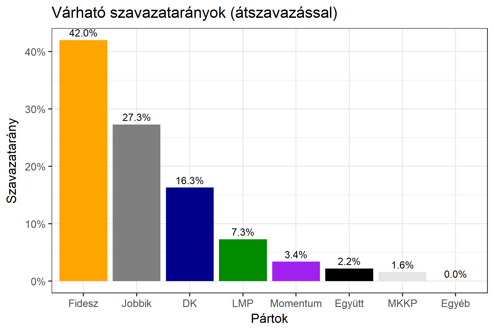

<h1 class="page-title">{{ page.title | escape }}</h1>

    

          

		  <h5>Hajdú-Bihar megye 2-es választókerület (Debrecen)</h5>
 <h5><strong>2018-as egyéni eredmények</strong></h5>  <table class="striped">
              <thead>
                <tr>
                    <th>Jelöltek</th>
                    <th>Szavazatarány (százalék)</th>
<th>Eltérés a becsléstől</th>
                </tr>
              </thead>
              <tbody>
             <tr>
                  <td>dr. Pósán László - Fidesz-KDNP </td>
				   <td id="id_fidesz">49.4%</td>
				   <td>+7.4%</td>
			</tr>
			<tr><td>Kőszeghy Ábel - Jobbik </td> 
			<td id="id_jobbik">25.4%</td>
				   <td>-1.9%</td>
			</tr>
<tr>
                  <td>Varga Zoltán - DK </td>
				   <td id="id_baloldal">12.0%</td>
				   <td>-4.3%</td>
			</tr>
			<tr>
                  <td>Görög Jenő - LMP </td>
				   <td id="id_lmp">6.0%</td>
				   <td>-1.3%</td>
			</tr>
			<tr>
				  <td>Mándi László - Momentum </td>
				   <td id="id_momentum">2.7%</td>
				   <td>-0.7%</td>
			</tr>
<tr>
<td>dr. Orosz Tamás -  Együtt </td>
 <td id="id_egyutt">1.1%</td>
				   <td>-1.1%</td>
</tr>          
<tr>
<td>Szabados István - MKKP </td>
 <td id="id_mkkp">2.1%</td>
				   <td>+0.5%</td>
</tr>      
              </tbody>
            </table><h6><strong>Választókerületi profil (2014-ben): Biztos Fideszes</strong></h6>
 
<h5><strong>2018. április 8-i becslések (átszavazással):</strong></h5>  
			<h6><strong>Becslés megbízhatósága a legesélyesebb jelöltről:</strong> <strong>Nincs egyértelmű esélyes</strong></h6> 
<h5><strong>Legesélyesebb ellenzéki jelölt: Kőszeghy Ábel (Jobbik)</strong></h5>
<h5><strong><a href="https://rendszervaltas2018.hu">Márki-Zay Péter ajánlása</a>: Kőszeghy Ábel (Jobbik)</strong></h5>

  <table class="striped">
              <thead>
                <tr>
                    <th>Jelöltek</th>
                    <th>Várható szavazatarány egyéniben (zárójelben az arányok átszavazás esetén)</th>
                </tr>
              </thead>
              <tbody>
             <tr>
                  <td>dr. Pósán László - Fidesz-KDNP </td>
				   <td id="id_fidesz">41.7% &emsp; (42.0%)</td>
			</tr>
			<tr><td>Kőszeghy Ábel - Jobbik </td> <td id="id_jobbik">23.0% &emsp; (27.3%)</td></tr>
<tr>
                  <td>Varga Zoltán - DK </td>
				   <td id="id_baloldal">17.2% &emsp; (16.3%)</td>
			</tr>
			<tr>
                  <td>Görög Jenő - LMP </td>
				   <td id="id_lmp">8.9% &emsp; (7.3%)</td>
			</tr>
			<tr>
				  <td>Mándi László - Momentum </td>
				   <td id="id_momentum">4.1% &emsp; (3.4%)</td>
			</tr>
<tr>
<td>dr. Orosz Tamás -  Együtt </td>
 <td id="id_egyutt">3.1% &emsp; (2.2%)</td>
</tr>          
<tr>
<td>Szabados István - MKKP </td>
 <td id="id_mkkp">2.0% &emsp; (1.6%)</td>
</tr>      
              </tbody>
            </table><h5>Várható győztes: Fidesz-KDNP</h5>
			
			
 
<strong>Fontos:</strong> A becslések csak az egyéni jelöltre adott szavazatok arányát mutatják, nem a listás szavazatokét. A becslés jelentős eltérést mutathat a kisebb pártok esetében és olyan kerületekben, ahol nincs egyértelmű esélyes jelölt.

 
			

          

    

    

          

		  <h5>Hajdú-Bihar megye 2-es választókerület (Debrecen) - 2014-es eredmények</h5>
            <table class="striped">
              <thead>
                <tr>
                    <th>Jelöltek</th>
                    <th>Szavazatarányok</th>
                </tr>
              </thead>
              <tbody>
             <tr>
                  <td>Dr. Pósán László - Fidesz-KDNP</td>
				  <td>45.4%</td>
			</tr>
			<tr>
			      <td>Dr. Rónai György - Összefogás (MSZP-Együtt-DK-PM-MLP)</td>
				  <td>24.0%</td>
			      
			</tr>
			<tr>
			      <td>Kőszeghy Csanád Ábel - Jobbik</td>
				  <td>22.1%</td>
			</tr>
			<tr>
				  <td>Görög Jenő - LMP</td>
				  <td>5.4%</td>
			</tr>                
              </tbody>
            </table>
			<h5>Győztes: Fidesz-KDNP, 21.4%-kal</h5>
          

    

