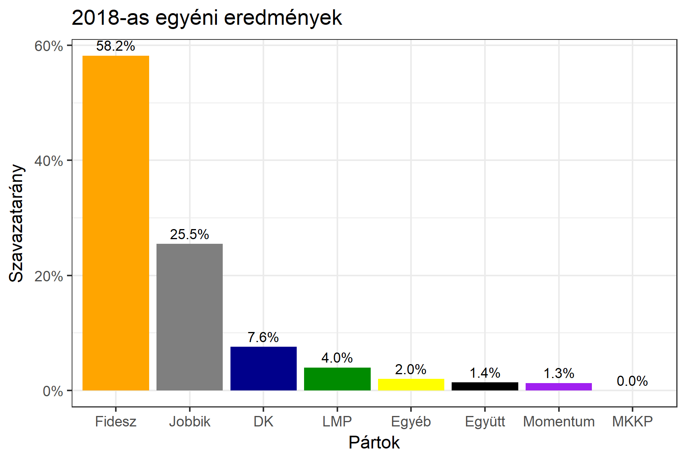

<h1 class="page-title">{{ page.title | escape }}</h1>

    

          

		  <h5>Hajdú-Bihar megye 3-as választókerület (Debrecen)</h5>
 <h5><strong>2018-as egyéni eredmények</strong></h5>  <table class="striped">
              <thead>
                <tr>
                    <th>Jelöltek</th>
                    <th>Szavazatarány (százalék)</th>
<th>Eltérés a becsléstől</th>
                </tr>
              </thead>
              <tbody>
             <tr>
                  <td>Tasó László - Fidesz-KDNP </td>
				   <td id="id_fidesz">58.2%</td>
				   <td>+8.8%</td>
			</tr>
			<tr><td>Csikai József - Jobbik </td> 
			<td id="id_jobbik">25.5%</td>
				   <td>-7.2%</td>
			</tr>
<tr>
                  <td>Káposznyák István - DK </td>
				  <td id="id_baloldal">7.6%</td>
				   <td>-3.6%</td>
			</tr>
			<tr>
                  <td>Kiss Tamás Péter - LMP </td>
				   <td id="id_lmp">4.0%</td>
				   <td>-0.4%</td>
			</tr>
			<tr>
				  <td>Lakatos Árpád - Momentum </td>
				   <td id="id_momentum">1.3%</td>
				   <td>-0.2%</td>
			</tr>
<tr>
<td>Kosztin Mihály -  Együtt </td>
 <td id="id_egyutt">1.4%</td>
				   <td>+0.5%</td>
</tr>                
              </tbody>
            </table><h6><strong>Választókerületi profil (2014-ben): Biztos Fideszes</strong></h6>
 

 
			

          

    

    

          

		  <h5>Hajdú-Bihar megye 3-as választókerület (Debrecen) - 2014-es eredmények</h5>
            <table class="striped">
              <thead>
                <tr>
                    <th>Jelöltek</th>
                    <th>Szavazatarányok</th>
                </tr>
              </thead>
              <tbody>
             <tr>
                  <td>Tasó László - Fidesz-KDNP</td>
				  <td>51.6%</td>
			</tr>
			<tr>
			      <td>Ágoston Tibor - Jobbik</td>
				  <td>24.9%</td>
			</tr>
			<tr>
			      <td>Pallás György - Összefogás (MSZP-Együtt-DK-PM-MLP)</td>
				  <td>17.4%</td>    
			</tr>
			<tr>
				  <td>	Kádi István Lajos - LMP</td>
				  <td>3.1%</td>
			</tr>                
              </tbody>
            </table>
			<h5>Győztes: Fidesz-KDNP, 26.7%-kal</h5>
          

    

