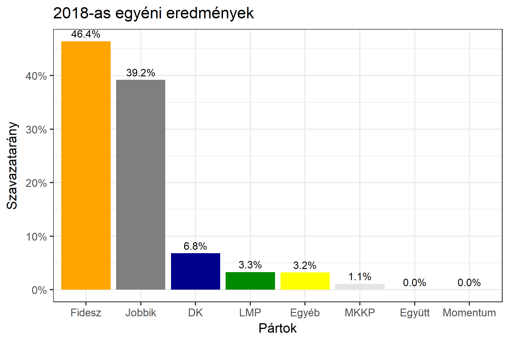

<h1 class="page-title">{{ page.title | escape }}</h1>

    

          

		  <h5>Heves megye 1-es választókerület (Eger)</h5>
 <h5><strong>2018-as egyéni eredmények</strong></h5>  <table class="striped">
              <thead>
                <tr>
                    <th>Jelöltek</th>
                    <th>Szavazatarány (százalék)</th>
<th>Eltérés a becsléstől</th>
                </tr>
              </thead>
              <tbody>
             <tr>
                  <td>Nyitrai Zsolt - Fidesz-KDNP </td>
				   <td id="id_fidesz">46.4%</td>
				   <td>+10.2%</td>
			</tr>
			<tr><td>Mirkóczki Ádám - Jobbik </td> 
			<td id="id_jobbik">39.2%</td>
				   <td>-3.2%</td>
			</tr>
<tr>
                  <td>Kertészné Kormos Noémi - DK </td>
				  <td id="id_baloldal">6.8%</td>
				   <td>-9.0%</td>
			</tr>
			<tr>
                  <td>Komlósi Csaba - LMP </td>
				   <td id="id_lmp">3.3%</td>
				   <td>-1.6%</td>
			</tr>
<tr>
<td>Várady Zoltán - MKKP </td>
 <td id="id_mkkp">1.1%</td>
				   <td>+0.4%</td>
</tr>              
              </tbody>
            </table><h6><strong>Választókerületi profil (2014-ben): Enyhén Fideszes (Jobbik / baloldal az esélyes kihívók)</strong></h6>
 

 
			

          

    

    

          

		  <h5>Heves megye 1-es választókerület (Eger) - 2014-es eredmények</h5>
            <table class="striped">
              <thead>
                <tr>
                    <th>Jelöltek</th>
                    <th>Szavazatarányok</th>
                </tr>
              </thead>
              <tbody>
             <tr>
                  <td>Dr. Nyitrai Zsolt Péter - Fidesz-KDNP</td>
				  <td>38.9%</td>
			</tr>
			<tr>
			      <td>Mirkóczki Ádám - Jobbik</td>
				  <td>28.4%</td>
			</tr>
			<tr>
			      <td>Dr. Szalóczi Géza György - Összefogás (MSZP-Együtt-DK-PM-MLP)</td>
				  <td>25.4%</td>
			      
			</tr>
			<tr>
				  <td>Dr. Csarnó Ákos - LMP</td>
				  <td>4.7%</td>
			</tr>                
              </tbody>
            </table>
			<h5>Győztes: Fidesz-KDNP, 10.5%-kal</h5>
          

    

