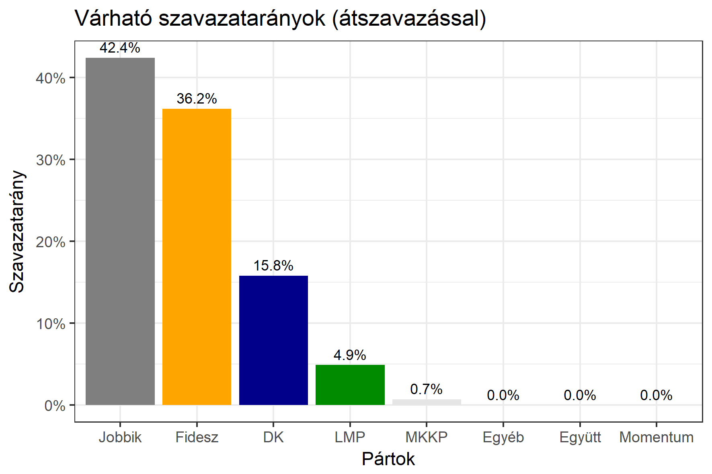

<h1 class="page-title">{{ page.title | escape }}</h1>

    

          
<h6><strong>A következő becslés várható időpontja: 2018. március 19.</strong></h6>
		  <h5>Heves megye 1-es választókerület (Eger)</h5>
 <h6><strong>Választókerületi profil (2014-ben): Enyhén Fideszes (Jobbik-baloldal)</strong></h6>
 
<h6><strong>Legfrissebb 2018-as becslések eredménye:</strong></h6> 
			<h5><strong>Legesélyesebb ellenzéki jelölt: Jobbik</strong></h5>
<table class="striped">
              <thead>
                <tr>
                    <th>Jelöltek</th>
                    <th>Várható szavazatarány egyéniben (átszavazással)</th>
                </tr>
              </thead>
              <tbody>
             <tr>
                  <td>Nyitrai Zsolt - Fidesz-KDNP </td>
				  <td id="id_fidesz">38.6%</td>
			</tr>
			<tr><td>Mirkóczki Ádám - Jobbik </td><td id="id_jobbik">39.2%</td></tr>
<tr>
                  <td>Kertészné Kormos Noémi - DK </td>
				  <td id="id_baloldal">13.5%</td>
			</tr>
			<tr>
                  <td>Komlósi Csaba - LMP </td>
				  <td id="lmp">5.7%</td>
			</tr>
			<tr>
				  <td>Tóth Zoltán - Momentum </td>
				  <td id="id_momentum">1.9%</td>
			</tr>
  
<tr>
<td>Várady Zoltán - MKKP </td>
<td id="id_mkkp">1.1%</td>
</tr>              
              </tbody>
            </table><h5>Várható győztes: Jobbik</h5>
			
			
  
<strong>Fontos:</strong> A becslések csak az egyéni jelöltre adott szavazatok arányát mutatják, nem a listás szavazatokét. A becslés jelentős eltérést mutathat a kisebb pártok esetében és olyan kerületekben, ahol nincs egyértelmű esélyes jelölt.

 
			
 <h6><strong>Becslés megbízhatósága a legesélyesebb jelöltről:</strong> <strong>Egyértelmű az esélyes - az esélyes jelölt várhatóan nem változik</strong></h6>

Megjegyzés a kerülethez: Az erős Jobbikos körzetben nagyon szoros eredmény várható. Magasabb átszavazás vagy koordinált indulás esetén a Jobbiké lesz a mandátum.

Az aktuális becslés leírásáról <a href="../metodologia#0312">bővebben itt olvashatsz</a>.

          

    

    

          

		  <h5>Heves megye 1-es választókerület (Eger) - 2014-es eredmények</h5>
            <table class="striped">
              <thead>
                <tr>
                    <th>Jelöltek</th>
                    <th>Szavazatarányok</th>
                </tr>
              </thead>
              <tbody>
             <tr>
                  <td>Dr. Nyitrai Zsolt Péter - Fidesz-KDNP</td>
				  <td>38.9%</td>
			</tr>
			<tr>
			      <td>Mirkóczki Ádám - Jobbik</td>
				  <td>28.4%</td>
			</tr>
			<tr>
			      <td>Dr. Szalóczi Géza György - Összefogás (MSZP-Együtt-DK-PM-MLP)</td>
				  <td>25.4%</td>
			      
			</tr>
			<tr>
				  <td>Dr. Csarnó Ákos - LMP</td>
				  <td>4.7%</td>
			</tr>                
              </tbody>
            </table>
			<h5>Győztes: Fidesz-KDNP, 10.5%-kal</h5>
          

    

