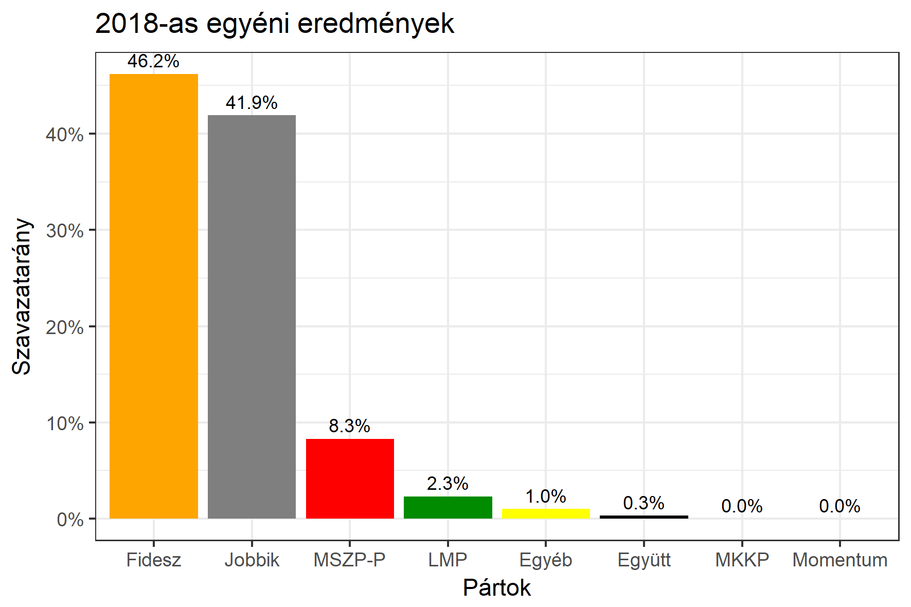

<h1 class="page-title">{{ page.title | escape }}</h1>

    

          

		  <h5>Heves megye 2-es választókerület (Gyöngyös)</h5>
 <h5><strong>2018-as egyéni eredmények</strong></h5>  <table class="striped">
              <thead>
                <tr>
                    <th>Jelöltek</th>
                    <th>Szavazatarány (százalék)</th>
<th>Eltérés a becsléstől</th>
                </tr>
              </thead>
              <tbody>
             <tr>
                  <td>Horváth László - Fidesz-KDNP </td>
				   <td id="id_fidesz">46.2%</td>
				   <td>+10.4%</td>
			</tr>
			<tr><td>Vona Gábor - Jobbik </td> 
			<td id="id_jobbik">41.9%</td>
				   <td>-6.3%</td>
			</tr>
<tr>
                  <td>Orosz Bálint János - MSZP-Párbeszéd </td>
				   <td id="id_baloldal">8.3%</td>
				   <td>-4.3%</td>
			</tr>
			<tr>
                  <td>Reichenberger János Gyula - LMP </td>
				   <td id="id_lmp">2.3%</td>
				   <td>-0.5%</td>
			</tr>
			<tr>
				  </tr>
<tr>
<td>Réz Ágnes -  Együtt </td>
 <td id="id_egyutt">0.3%</td>
				   <td>-0.3%</td>
</tr>                
              </tbody>
            </table><h6><strong>Választókerületi profil (2014-ben): Kétesélyes (Fidesz és Jobbik között)</strong></h6>
 

 
			

          

    

    

          

		  <h5>Heves megye 2-es választókerület (Gyöngyös) - 2014-es eredmények</h5>
            <table class="striped">
              <thead>
                <tr>
                    <th>Jelöltek</th>
                    <th>Szavazatarányok</th>
                </tr>
              </thead>
              <tbody>
             <tr>
                  <td>Horváth László Dezső - Fidesz-KDNP</td>
				  <td>37.0%</td>
			</tr>
			<tr>
			      <td>Vona Gábor - Jobbik</td>
				  <td>35.8%</td>
			</tr>
			<tr>
			      <td>Dr. Sós Tamás - Összefogás (MSZP-Együtt-DK-PM-MLP)</td>
				  <td>22.2%</td>
			      
			</tr>
			<tr>
				  <td>Dr. Lukács Zoltán - LMP</td>
				  <td>2.5%</td>
			</tr>                
              </tbody>
            </table>
			<h5>Győztes: Fidesz-KDNP, 1.2%-kal</h5>
          

    

